Diversity\_analysis
================
Sergio Gozalo
5 de abril de 2021

## Loading necessary libraries

``` r
library("vegan")
```

    ## Loading required package: permute

    ## Loading required package: lattice

    ## This is vegan 2.5-7

``` r
library("ggplot2")
library("tidyr")
library("plyr")
library("dplyr")
```

    ## 
    ## Attaching package: 'dplyr'

    ## The following objects are masked from 'package:plyr':
    ## 
    ##     arrange, count, desc, failwith, id, mutate, rename, summarise,
    ##     summarize

    ## The following objects are masked from 'package:stats':
    ## 
    ##     filter, lag

    ## The following objects are masked from 'package:base':
    ## 
    ##     intersect, setdiff, setequal, union

``` r
library("reshape2")
```

    ## 
    ## Attaching package: 'reshape2'

    ## The following object is masked from 'package:tidyr':
    ## 
    ##     smiths

``` r
library("randomcoloR")
```

# Tables

``` r
f_kegg_scgt <- t(read.table("functional.tables/EMOSE-GC_ICM_250bp_KEGG.ko.lengthNorm.SCGnorm.counts.tbl", header = TRUE, sep = "\t", row.names = 1))

f_kegg_mgnt <- t(read.table("functional.tables/EMOSE-GC_ICM_250bp_KEGG.ko.lengthNorm.metaGsizeNorm.counts.tbl", header = TRUE, sep = "\t", row.names = 1))


icm_cog_scgt <- t(read.table("functional.tables/EMOSE-GC_ICM_250bp_COG.lengthNorm.SCGnorm.counts.tbl", header = TRUE, sep = "\t", row.names = 1))

icm_cog_mgnt <- t(read.table("functional.tables/EMOSE-GC_ICM_250bp_COG.lengthNorm.metaGsizeNorm.counts.tbl", header = TRUE, sep = "\t", row.names = 1))


icm_pfam_scgt <- t(read.table("functional.tables/EMOSE-GC_ICM_250bp_pfam.lengthNorm.SCGnorm.counts.tbl", header = TRUE, sep = "\t", row.names = 1))

icm_pfam_mgnt <- t(read.table("functional.tables/EMOSE-GC_ICM_250bp_pfam.lengthNorm.metaGsizeNorm.counts.tbl", header = TRUE, sep = "\t", row.names = 1))


otu_mitags <- (read.delim("functional.tables/otu_table97.txt", header = TRUE, sep = "\t"))
otu_mitags$OTUId <- NULL
otu_mitags <- t(otu_mitags)
```

## Richness MiTags

``` r
otu_mitags_ss <- rrarefy(otu_mitags, min(rowSums(otu_mitags)))
richness <- estimateR(otu_mitags_ss)
richness
```

    ##          ERR2098365 ERR2098366 ERR2098367 ERR2098368 ERR2098369 ERR2098370
    ## S.obs    3429.00000 3335.00000 3367.00000  3157.0000 3271.00000 3006.00000
    ## S.chao1  5513.88927 5348.78169 5375.79483  5180.1059 5121.79406 4661.17850
    ## se.chao1  143.50735  140.95816  139.75507   148.1943  133.78328  125.62781
    ## S.ACE    5624.34807 5427.03239 5505.41779  5119.5362 5085.19307 4641.18457
    ## se.ACE     43.27665   42.33061   42.39752    40.8675   39.67505   37.60324
    ##          ERR2098371 ERR2098372 ERR2098373 ERR2098374 ERR2098375 ERR2098376
    ## S.obs    3067.00000 3100.00000 3086.00000 3020.00000 3210.00000 2938.00000
    ## S.chao1  4587.40566 4672.24132 4644.80185 4689.93398 4711.13599 4804.84783
    ## se.chao1  114.71800  116.72715  116.37873  124.83143  109.24066  137.42902
    ## S.ACE    4657.15089 4812.42081 4742.65378 4812.41614 4849.33204 4875.53928
    ## se.ACE     37.64675   38.62265   38.24368   39.70956   37.93542   40.38524
    ##          ERR2098377 ERR2098378 ERR2098379 ERR2098380 ERR2098381 ERR2098382
    ## S.obs    3037.00000  804.00000 2873.00000 2781.00000 3331.00000 3111.00000
    ## S.chao1  4749.46862 1937.44792 4471.13391 4246.12326 5133.39964 4412.69739
    ## se.chao1  130.40724  159.38568  124.51468  118.73620  130.26347   98.92025
    ## S.ACE    4638.73911 2046.40270 4481.15926 4134.24789 5065.57479 4491.68502
    ## se.ACE     37.24282   30.81547   37.11477   34.42297   39.00477   35.93538
    ##          ERR2098383 ERR2098384 ERR2098385 ERR2098386 ERR2098387 ERR2098388
    ## S.obs    3082.00000 2679.00000 1916.00000 1227.00000  581.00000 2933.00000
    ## S.chao1  4839.57143 3611.77756 3850.45427 2753.65574 1350.50000 4537.98101
    ## se.chao1  128.81029   78.86077  163.10124  163.31924  129.15883  124.03537
    ## S.ACE    4880.66091 3727.81159 4208.80622 3084.42067 1374.17293 4509.26536
    ## se.ACE     40.22799   32.25730   42.72671   37.06904   23.75044   36.98707
    ##          ERR2098389 ERR2098390 ERR2098391 ERR2098392 ERR2098393 ERR2098394
    ## S.obs    2785.00000 2749.00000 3636.00000 3330.00000 3695.00000 1268.00000
    ## S.chao1  4437.93224 4356.00495 5530.32317 4579.17213 5595.29674 3098.41899
    ## se.chao1  131.19894  130.58581  128.31198   94.13386  127.58496  192.37754
    ## S.ACE    4367.32225 4194.42501 5655.17467 4619.78966 5733.16964 3520.75695
    ## se.ACE     36.43721   35.31178   42.29511   35.17679   42.02294   40.44365
    ##          ERR2098395 ERR2098396 ERR2098397 ERR2098398 ERR2098399 ERR2098400
    ## S.obs    1175.00000 1035.00000 1850.00000 2665.00000 2772.00000 2780.00000
    ## S.chao1  2655.21053 2117.88820 3488.55287 3969.93103 4488.50980 4362.28162
    ## se.chao1  162.92537  127.55896  141.56917  107.73197  137.41498  127.45153
    ## S.ACE    2887.78072 2319.80905 3800.26629 3968.92293 4315.49422 4218.97036
    ## se.ACE     36.20519   32.12024   41.10795   33.81921   36.08951   35.30709
    ##          ERR2098401 ERR2098402 ERR2098403 ERR2098404 ERR2098405 ERR2098406
    ## S.obs    2709.00000 3524.00000 3519.00000  3734.0000 3657.00000   971.0000
    ## S.chao1  4342.41912 5136.76471 5525.66667  5760.3186 5687.29968  1924.6395
    ## se.chao1  131.92717  113.32638  140.86483   135.4691  137.11818   118.2146
    ## S.ACE    4260.67229 5230.37881 5392.85184  5747.3142 5720.18181  2070.6338
    ## se.ACE     35.82083   39.34952   40.38466    41.5805   41.70253    29.0152
    ##          ERR2098407 ERR2098408 ERR2098409 ERR2098410 ERR2098411 ERR2196983
    ## S.obs     993.00000 2489.00000 2495.00000 3482.00000 3550.00000 1399.00000
    ## S.chao1  2220.46853 3823.83854 3924.68000 5565.32927 5399.22705 3283.34450
    ## se.chao1  147.88585  114.04167  121.51224  144.43419  127.96788  186.56017
    ## S.ACE    2410.68140 3823.81127 3883.30215 5490.77674 5450.95596 3830.41684
    ## se.ACE     31.05941   33.63934   34.58418   41.43498   40.45248   43.24307
    ##          ERR2196984 ERR2196985
    ## S.obs    2870.00000 3688.00000
    ## S.chao1  4556.83149 5584.88525
    ## se.chao1  131.19737  127.57323
    ## S.ACE    4527.50904 5690.92102
    ## se.ACE     37.29238   41.69917

## Rarefaction MiTags

``` r
otu_rare <- rarefaction(otu_mitags_ss)
```

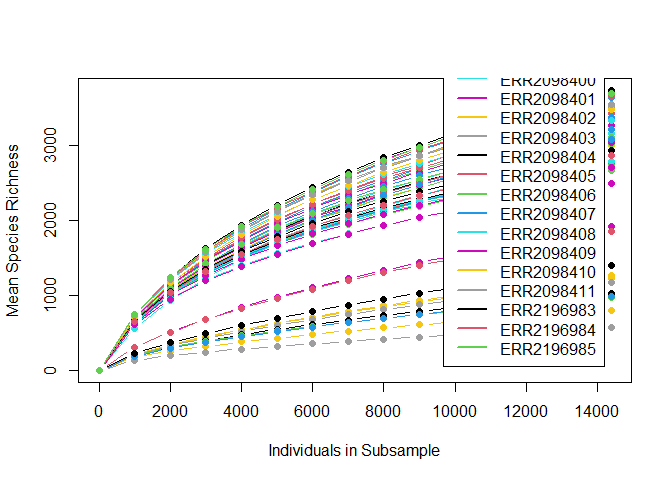

    ## [1] "rarefaction by J. Jacobs, last update April 17, 2009"

## Rarecurve MiTags

``` r
otu_rcurve <- rarecurve(otu_mitags_ss)
```

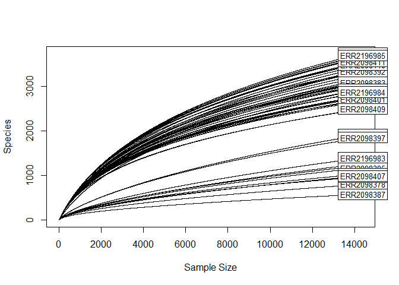

## Acumulation curve MiTags

``` r
otu_acc <- specaccum(otu_mitags_ss, method = "exact", permutations = 1000)
```

    ## Warning in cor(x > 0): the standard deviation is zero

``` r
plot(otu_acc)
```

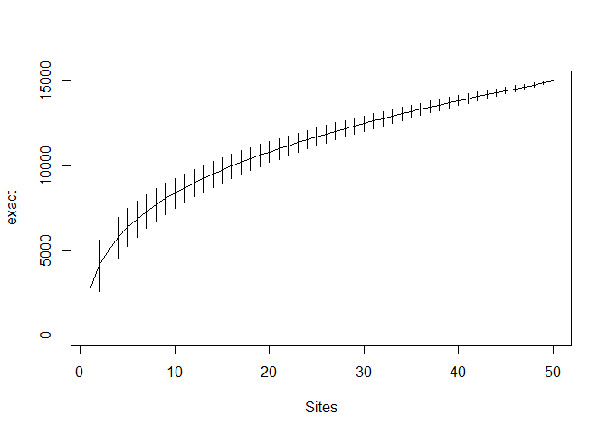

## Accumulation curve KEGG SCG

### Whole

``` r
kegg_acc1 <- specaccum(f_kegg_scgt, method = "exact", permutations = 1000)
```

    ## Warning in cor(x > 0): the standard deviation is zero

``` r
plot(kegg_acc1)
```

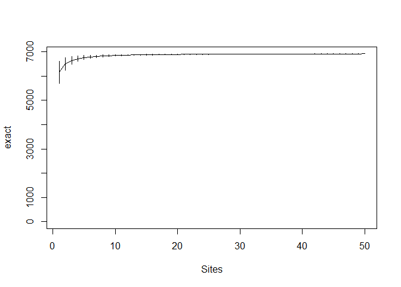

### Subsampled

``` r
f_kegt <- as.data.frame(f_kegg_scgt)
f_kegt[,1:6965] <- sapply(f_kegt[, c(1:6965)], as.integer)

kegg_ss <- rrarefy(f_kegt, min(rowSums(f_kegt)))
kegg_acc2 <- specaccum(kegg_ss, method = "exact", permutations = 1000)
```

    ## Warning in cor(x > 0): the standard deviation is zero

``` r
plot(kegg_acc2)
```

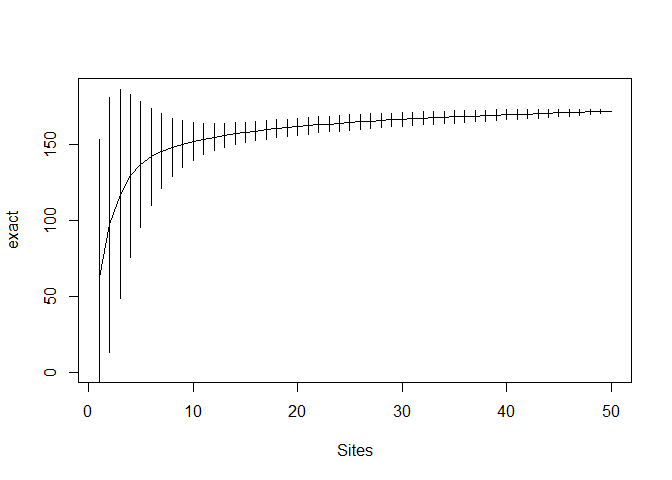

## Accumulation curve KEGG MGN

### Whole

``` r
kegg_acc1.1 <- specaccum(f_kegg_mgnt, method = "exact", permutations = 1000)
```

    ## Warning in cor(x > 0): the standard deviation is zero

``` r
plot(kegg_acc1.1)
```


### Subsampled

``` r
f_kegg_mgnt <- as.data.frame(f_kegg_mgnt)
f_kegg_mgnt[,1:6965] <- sapply(f_kegg_mgnt[, c(1:6965)], as.integer)
length(f_kegg_mgnt[,])
```

    ## [1] 6965

``` r
kegg_ss2 <- rrarefy(f_kegg_mgnt, min(rowSums(f_kegg_mgnt)))
kegg_acc2.2 <- specaccum(kegg_ss2, method = "exact", permutations = 1000)
```

    ## Warning in cor(x > 0): the standard deviation is zero

``` r
plot(kegg_acc2.2)
```

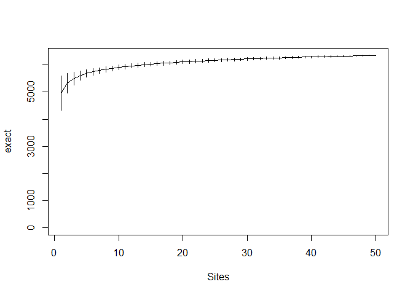

## Accumulation curve COG SCG

### Whole

``` r
cog_acc1 <- specaccum(icm_cog_scgt, method = "exact", permutations = 1000)
```

    ## Warning in cor(x > 0): the standard deviation is zero

``` r
plot(cog_acc1)
```


### Subsampled

``` r
icm_cog_scgt <- as.data.frame(icm_cog_scgt)
icm_cog_scgt[,1:4873] <- sapply(icm_cog_scgt[, c(1:4873)], as.integer)

cog_ss <- rrarefy(icm_cog_scgt, min(rowSums(icm_cog_scgt)))
cog_acc2.1 <- specaccum(cog_ss, method = "exact", permutations = 1000)
```

    ## Warning in cor(x > 0): the standard deviation is zero

``` r
plot(cog_acc2.1)
```

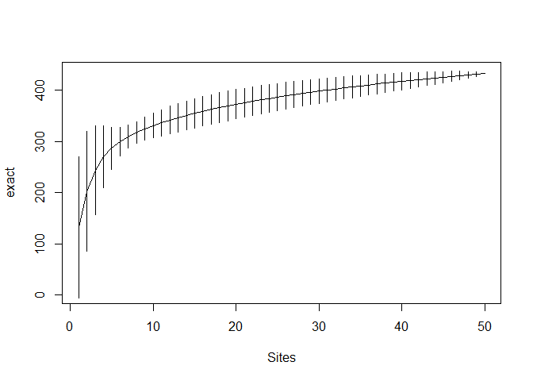

## Accumulation curve COG MGN

### Whole

``` r
cog_acc2 <- specaccum(icm_cog_mgnt, method = "exact", permutations = 1000)
```

    ## Warning in cor(x > 0): the standard deviation is zero

``` r
plot(cog_acc2)
```


### Subsampled

``` r
icm_cog_mgnt <- as.data.frame(icm_cog_mgnt)
icm_cog_mgnt[,1:4873] <- sapply(icm_cog_mgnt[, c(1:4873)], as.integer)

cog_ss <- rrarefy(icm_cog_mgnt, min(rowSums(icm_cog_mgnt)))
cog_acc2.1 <- specaccum(cog_ss, method = "exact", permutations = 1000)
```

    ## Warning in cor(x > 0): the standard deviation is zero

``` r
plot(cog_acc2.1)
```

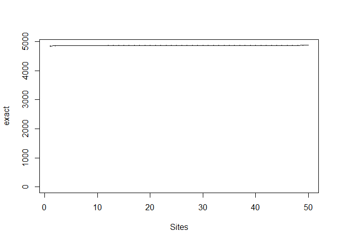

## Accumulation curve PFAM SCG

### Whole

``` r
pfam_acc1 <- specaccum(icm_pfam_scgt, method = "exact", permutations = 1000)
```

    ## Warning in cor(x > 0): the standard deviation is zero

``` r
plot(pfam_acc1)
```


### Subsampled

``` r
icm_pfam_scgt <- as.data.frame(icm_pfam_scgt)
icm_pfam_scgt[,1:16702] <- sapply(icm_pfam_scgt[, c(1:16702)], as.integer)

pfam_ss <- rrarefy(icm_pfam_scgt, min(rowSums(icm_pfam_scgt)))
pfam_acc2.1 <- specaccum(pfam_ss, method = "exact", permutations = 1000)
```

    ## Warning in cor(x > 0): the standard deviation is zero

``` r
plot(pfam_acc2.1)
```

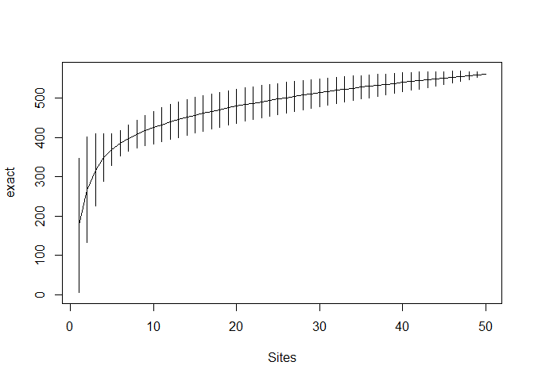

## Accumulation curve COG MGN

### Whole

``` r
pfam_acc2 <- specaccum(icm_pfam_mgnt, method = "exact", permutations = 1000)
```

    ## Warning in cor(x > 0): the standard deviation is zero

``` r
plot(pfam_acc2)
```

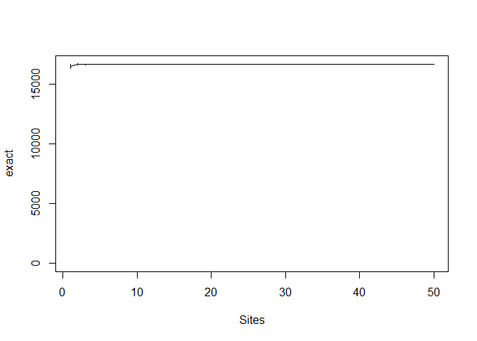

### Subsampled

``` r
icm_pfam_mgnt <- as.data.frame(icm_pfam_mgnt)
icm_pfam_mgnt[,1:16702] <- sapply(icm_pfam_mgnt[, c(1:16702)], as.integer)

pfam_ss <- rrarefy(icm_pfam_mgnt, min(rowSums(icm_pfam_mgnt)))
pfam_acc2.1 <- specaccum(pfam_ss, method = "exact", permutations = 1000)
```

    ## Warning in cor(x > 0): the standard deviation is zero

``` r
plot(pfam_acc2.1)
```

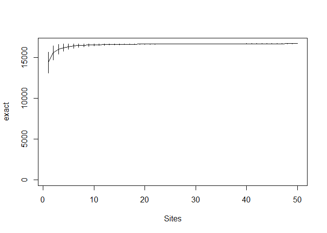
