Bioinformatic methods comparisson
================
Sergio Gozalo
19 de mayo de 2021

## Loading necessary libraries

# EBI tables

## Table reading EBI

``` r
ebi_go_abundances <- read.table("functional.tables/ERP112966_GO_abundances_v4.1.tsv", header = TRUE, row.names = 1, sep ="\t")
ebi_go_abundances$description <- NULL #Need to remove this column to work
ebi_go_abundances$category <- NULL #Need to remove this column to work
ebi_go_abundances <- t(ebi_go_abundances)

ebi_go.slim_abundances <- read.table("functional.tables/ERP112966_GO-slim_abundances_v4.1.tsv", header = TRUE, row.names = 1, sep ="\t")
ebi_go.slim_abundances$description <- NULL
ebi_go.slim_abundances$category <- NULL
ebi_go.slim_abundances <- t(ebi_go.slim_abundances)

ebi_ipr_abundances <- read.table("functional.tables/ERP112966_IPR_abundances_v4.1.tsv", header = TRUE, row.names = 1, sep ="\t")
ebi_ipr_abundances$description <- NULL
ebi_ipr_abundances$category <- NULL
ebi_ipr_abundances <- t(ebi_ipr_abundances)
```

## Table subsampling and zeros removal

``` r
ebi_go_abundances.ss<- rrarefy(ebi_go_abundances, min(rowSums(ebi_go_abundances)))
ebi_go_abundances.ss.nocero<-ebi_go_abundances.ss[,-(which(colSums(ebi_go_abundances.ss)==0))]

ebi_go.slim_abundances.ss<- rrarefy(ebi_go.slim_abundances, min(rowSums(ebi_go.slim_abundances)))
ebi_go.slim_abundances.ss.nocero<-ebi_go.slim_abundances.ss[,-(which(colSums(ebi_go.slim_abundances.ss)==0))]

ebi_ipr_abundances.ss<- rrarefy(ebi_ipr_abundances, min(rowSums(ebi_ipr_abundances)))
ebi_ipr_abundances.ss.nocero<-ebi_ipr_abundances.ss[,-(which(colSums(ebi_ipr_abundances.ss)==0))]
```

## NMDS

``` r
go.bray <- vegdist(ebi_go_abundances.ss.nocero, method="bray")
go_slim.bray <- vegdist(ebi_go.slim_abundances.ss, method = "bray")
ipr.bray <- vegdist(ebi_ipr_abundances.ss, method = "bray")
```

### GO

``` r
go.bray.nmds<-metaMDS(go.bray, k=2, trymax=100, trace=F, autotransform = F, distance="bray")
stressplot(go.bray.nmds)
```

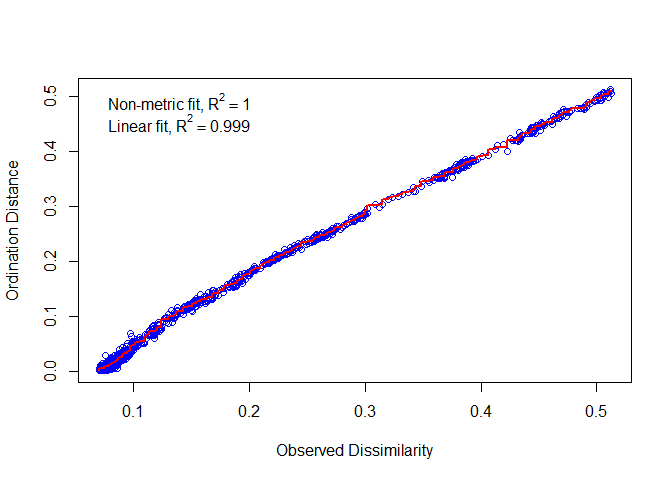

``` r
plot(go.bray.nmds, display = "sites")
```

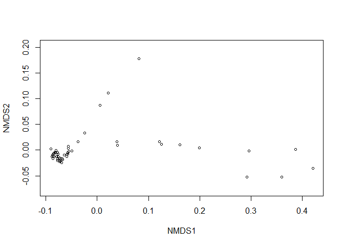

### GO-SLIM

``` r
go_slim.bray.nmds<-metaMDS(go_slim.bray, k=2, trymax=100, trace=F, autotransform = F, distance="bray")
stressplot(go_slim.bray.nmds)
```

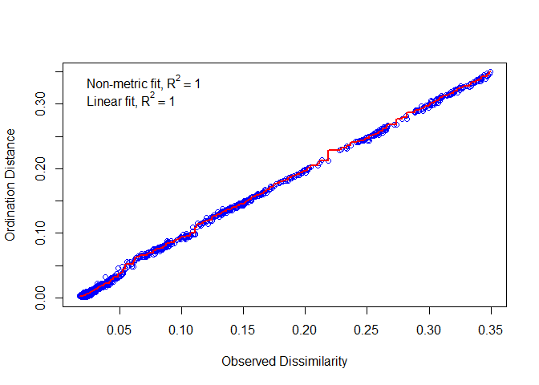

``` r
plot(go_slim.bray.nmds, display = "sites")
```

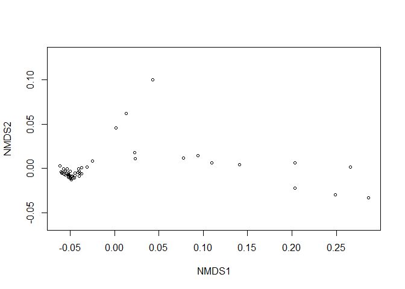

### IPR

``` r
ipr.bray.nmds<-metaMDS(ipr.bray, k=2, trymax=100, trace=F, autotransform = F, distance="bray")
stressplot(ipr.bray.nmds)
```

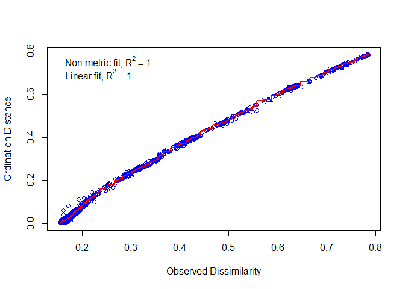

``` r
plot(ipr.bray.nmds, display = "sites")
```

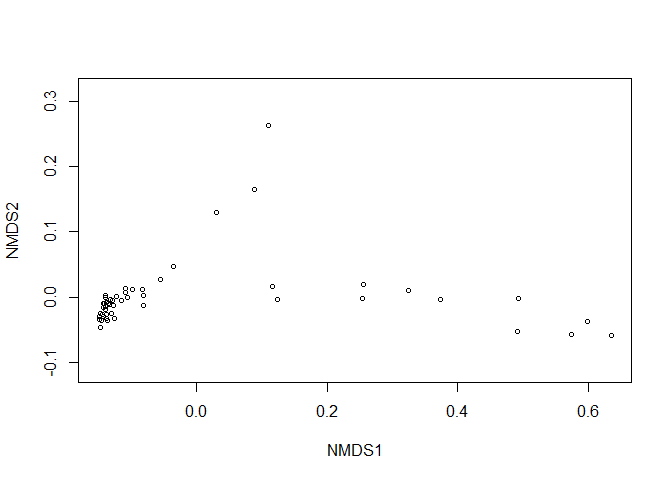

## CLUSTERING

### GO

``` r
cluster.go.bray.upgma<-recluster.cons(go.bray, tr=100, p=0.5, method="average")

cluster.go.bray.upgma.boot<-recluster.boot(cluster.go.bray.upgma$cons, ebi_go_abundances.ss.nocero,tr=100, p=0.5, method="average", boot=1000, level=1)
recluster.plot(cluster.go.bray.upgma$cons,cluster.go.bray.upgma.boot)
```

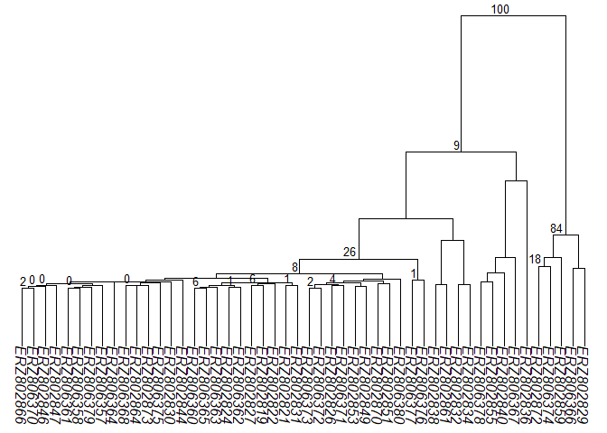

### GO-SLIM

``` r
cluster.go.slim.bray.upgma<-recluster.cons(go_slim.bray, tr=100, p=0.5, method="average")

cluster.go.slim.bray.upgma.boot<-recluster.boot(cluster.go.slim.bray.upgma$cons, ebi_go.slim_abundances.ss.nocero,tr=100, p=0.5, method="average", boot=1000, level=1)
recluster.plot(cluster.go.slim.bray.upgma$cons,cluster.go.slim.bray.upgma.boot)
```

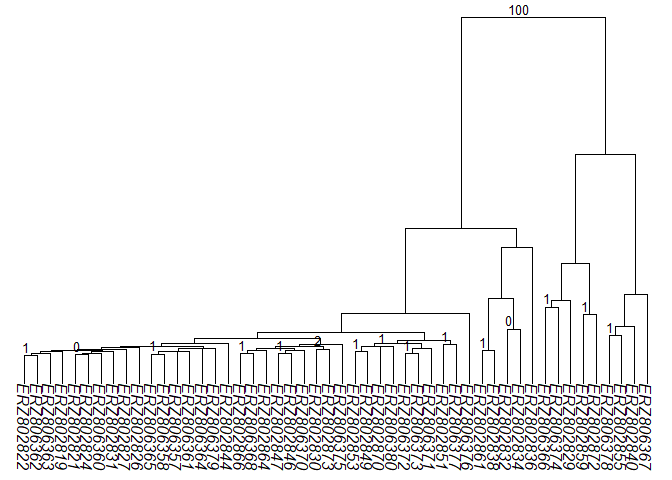

### IPR

``` r
cluster.ipr.bray.upgma<-recluster.cons(ipr.bray, tr=100, p=0.5, method="average")

cluster.ipr.bray.upgma.boot<-recluster.boot(cluster.ipr.bray.upgma$cons, ebi_ipr_abundances.ss.nocero,tr=100, p=0.5, method="average", boot=1000, level=1)
recluster.plot(cluster.ipr.bray.upgma$cons,cluster.ipr.bray.upgma.boot)
```

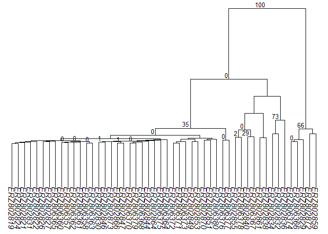

# ICM tables

## Table reading ICM

``` r
icm_kegg_meta <- t(read.table("functional.tables/EMOSE-GC_ICM_250bp_KEGG.ko.lengthNorm.metaGsizeNorm.counts.tbl", header = TRUE, sep = "\t", row.names = 1))
icm_kegg_scg <- t(read.table("functional.tables/EMOSE-GC_ICM_250bp_KEGG.ko.lengthNorm.SCGnorm.counts.tbl", header = TRUE, sep = "\t", row.names = 1))

icm_cog_meta <- t(read.table("functional.tables/EMOSE-GC_ICM_250bp_COG.lengthNorm.metaGsizeNorm.counts.tbl", header = TRUE, sep = "\t", row.names = 1))
icm_cog_scg <- t(read.table("functional.tables/EMOSE-GC_ICM_250bp_COG.lengthNorm.SCGnorm.counts.tbl", header = TRUE, sep = "\t", row.names = 1))

icm_pfam_meta <- t(read.table("functional.tables/EMOSE-GC_ICM_250bp_pfam.lengthNorm.metaGsizeNorm.counts.tbl", header = TRUE, sep = "\t", row.names = 1))
icm_pfam_scg <- t(read.table("functional.tables/EMOSE-GC_ICM_250bp_pfam.lengthNorm.SCGnorm.counts.tbl", header = TRUE, sep = "\t", row.names = 1))
```

## Table subsampling and zeros removal

``` r
# KEGG
icm_kegg_meta <- as.data.frame(icm_kegg_meta)
icm_kegg_meta[,1:6965] <- sapply(icm_kegg_meta[, c(1:6965)], as.integer)
icm_kegg_scg <- as.data.frame(icm_kegg_scg)
icm_kegg_scg[,1:6965] <- sapply(icm_kegg_scg[, c(1:6965)], as.integer)

icm_kegg_meta.ss<- rrarefy(icm_kegg_meta, min(rowSums(icm_kegg_meta)))
icm_kegg_meta.ss.nocero<-icm_kegg_meta.ss[,-(which(colSums(icm_kegg_meta.ss)==0))]
icm_kegg_scg.ss<- rrarefy(icm_kegg_scg, min(rowSums(icm_kegg_scg)))
icm_kegg_scg.ss.nocero<-icm_kegg_scg.ss[,-(which(colSums(icm_kegg_scg.ss)==0))]

# COG
icm_cog_meta <- as.data.frame(icm_cog_meta)
icm_cog_meta[,1:4873] <- sapply(icm_cog_meta[, c(1:4873)], as.integer)
icm_cog_scg <- as.data.frame(icm_cog_scg)
icm_cog_scg[,1:4873] <- sapply(icm_cog_scg[, c(1:4873)], as.integer)

icm_cog_meta.ss<- rrarefy(icm_cog_meta, min(rowSums(icm_cog_meta)))
icm_cog_meta.ss.nocero<-icm_cog_meta.ss[,-(which(colSums(icm_cog_meta.ss)==0))]
icm_cog_scg.ss<- rrarefy(icm_cog_scg, min(rowSums(icm_cog_scg)))
icm_cog_scg.ss.nocero<-icm_cog_scg.ss[,-(which(colSums(icm_cog_scg.ss)==0))]

# IPR
icm_pfam_meta <- as.data.frame(icm_pfam_meta)
icm_pfam_meta[,1:16702] <- sapply(icm_pfam_meta[, c(1:16702)], as.integer)
icm_pfam_scg <- as.data.frame(icm_pfam_scg)
icm_pfam_scg[,1:16702] <- sapply(icm_pfam_scg[, c(1:16702)], as.integer)

icm_pfam_meta.ss<- rrarefy(icm_pfam_meta, min(rowSums(icm_pfam_meta)))
icm_pfam_meta.ss.nocero<-icm_pfam_meta.ss[,-(which(colSums(icm_pfam_meta.ss)==0))]
icm_pfam_scg.ss<- rrarefy(icm_pfam_scg, min(rowSums(icm_pfam_scg)))
icm_pfam_scg.ss.nocero<-icm_pfam_scg.ss[,-(which(colSums(icm_pfam_scg.ss)==0))]
```

## NMDS

``` r
kegg_meta.bray <- vegdist(icm_kegg_meta.ss.nocero, method="bray")
kegg_scg.bray <- vegdist(icm_kegg_scg.ss.nocero, method="bray")

cog_meta.bray <- vegdist(icm_cog_meta.ss.nocero, method="bray")
cog_scg.bray <- vegdist(icm_cog_scg.ss.nocero, method="bray")

pfam_meta.bray <- vegdist(icm_pfam_meta.ss.nocero, method="bray")
pfam_scg.bray <- vegdist(icm_pfam_scg.ss.nocero, method="bray")
```

### KEGG

#### SCG

``` r
icm_kegg_scg.bray.nmds<-metaMDS(kegg_scg.bray, k=2, trymax=100, trace=F, autotransform = F, distance="bray")
stressplot(icm_kegg_scg.bray.nmds)
```

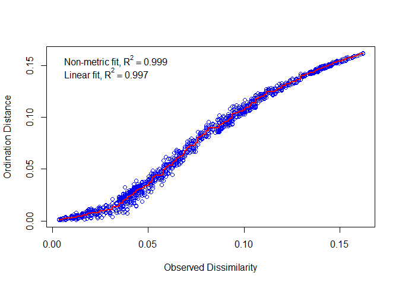

``` r
plot(icm_kegg_scg.bray.nmds, display = "sites")
```

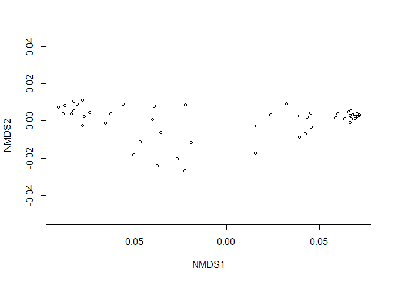

#### Meta

``` r
icm_kegg_meta.bray.nmds<-metaMDS(kegg_meta.bray, k=2, trymax=100, trace=F, autotransform = F, distance="bray")
stressplot(icm_kegg_meta.bray.nmds)
```

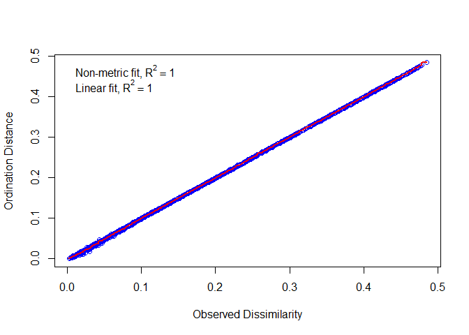

``` r
plot(icm_kegg_meta.bray.nmds, display = "sites")
```

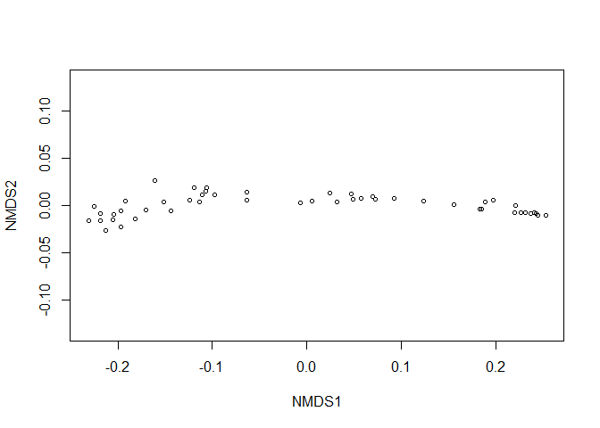

### COG

#### SCG

``` r
icm_cog_scg.bray.nmds<-metaMDS(cog_scg.bray, k=2, trymax=100, trace=F, autotransform = F, distance="bray")
stressplot(icm_cog_scg.bray.nmds)
```

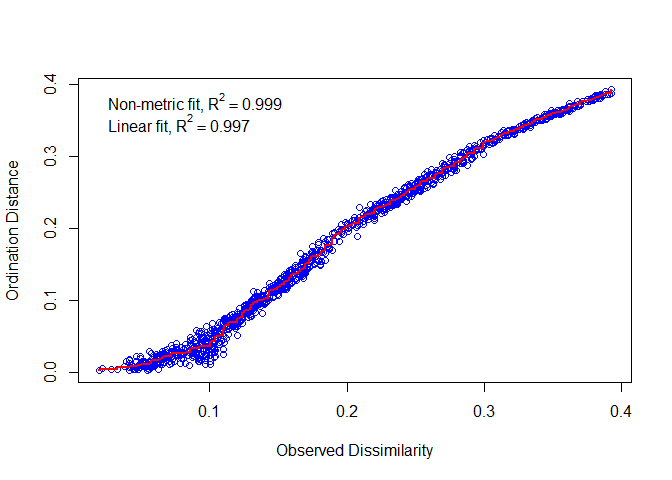

``` r
plot(icm_cog_scg.bray.nmds, display = "sites")
```

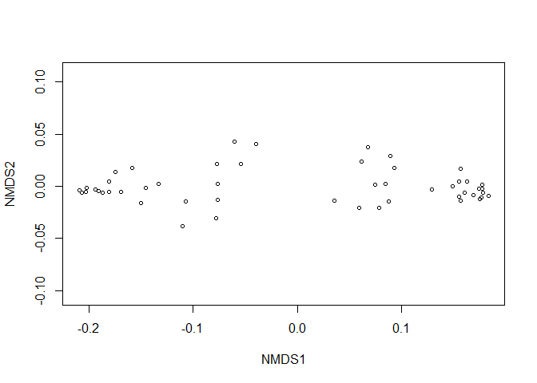

#### Meta

``` r
icm_cog_meta.bray.nmds<-metaMDS(cog_meta.bray, k=2, trymax=100, trace=F, autotransform = F, distance="bray")
stressplot(icm_cog_meta.bray.nmds)
```

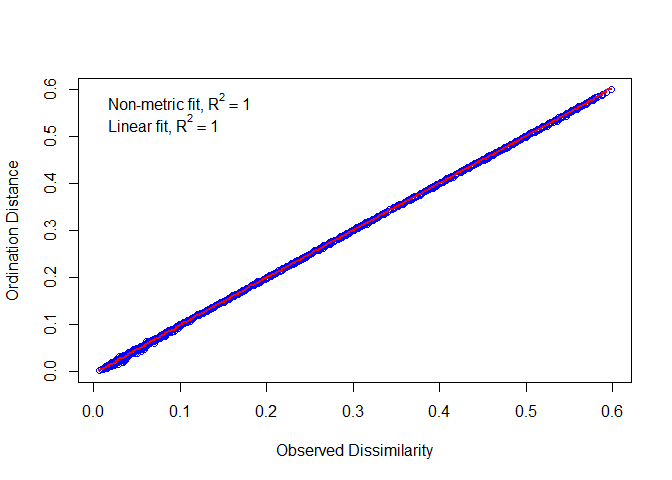

``` r
plot(icm_cog_meta.bray.nmds, display = "sites")
```

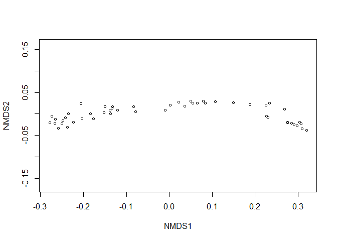

### PFAM

#### SCG

``` r
icm_pfam_scg.bray.nmds<-metaMDS(pfam_scg.bray, k=2, trymax=100, trace=F, autotransform = F, distance="bray")
stressplot(icm_pfam_scg.bray.nmds)
```

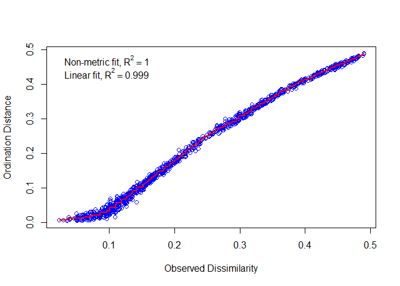

``` r
plot(icm_pfam_scg.bray.nmds, display = "sites")
```

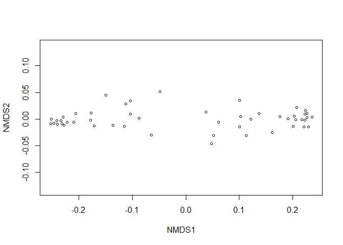

#### Meta

``` r
icm_pfam_meta.bray.nmds<-metaMDS(pfam_meta.bray, k=2, trymax=100, trace=F, autotransform = F, distance="bray")
stressplot(icm_pfam_meta.bray.nmds)
```

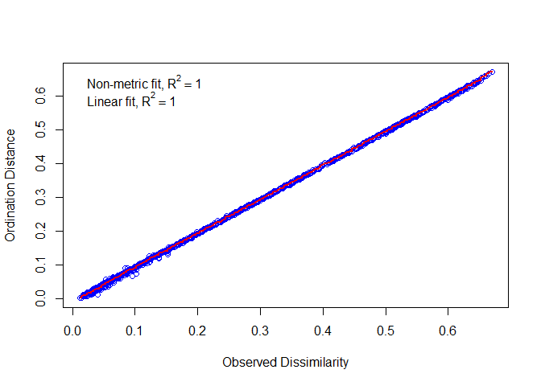

``` r
plot(icm_pfam_meta.bray.nmds, display = "sites")
```

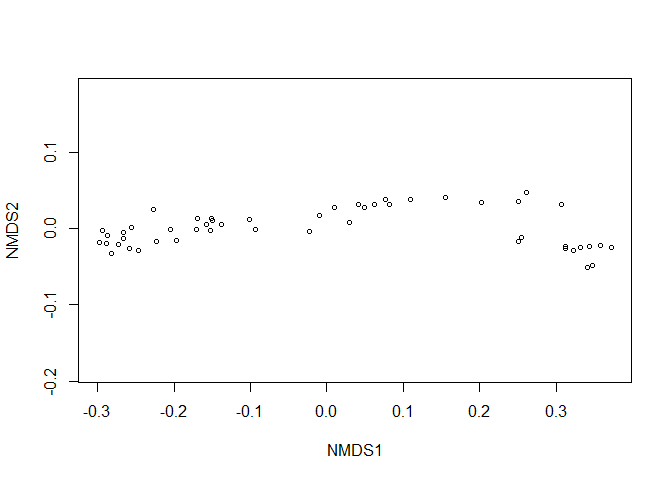

## CLUSTERING

### KEGG

#### SCG

``` r
cluster.kegg_scg.bray.upgma<-recluster.cons(kegg_scg.bray, tr=100, p=0.5, method="average")

cluster.kegg_scg.bray.upgma.boot<-recluster.boot(cluster.kegg_scg.bray.upgma$cons, icm_kegg_scg.ss.nocero,tr=100, p=0.5, method="average", boot=1000, level=1)
recluster.plot(cluster.kegg_scg.bray.upgma$cons,cluster.kegg_scg.bray.upgma.boot)
```

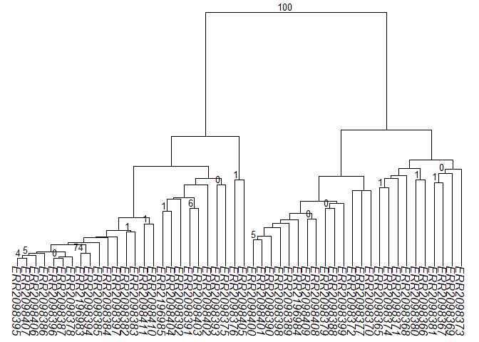

#### Meta

``` r
cluster.kegg_meta.bray.upgma<-recluster.cons(kegg_meta.bray, tr=100, p=0.5, method="average")

cluster.kegg_meta.bray.upgma.boot<-recluster.boot(cluster.kegg_meta.bray.upgma$cons, icm_kegg_meta.ss.nocero,tr=100, p=0.5, method="average", boot=1000, level=1)
recluster.plot(cluster.kegg_meta.bray.upgma$cons,cluster.kegg_meta.bray.upgma.boot)
```

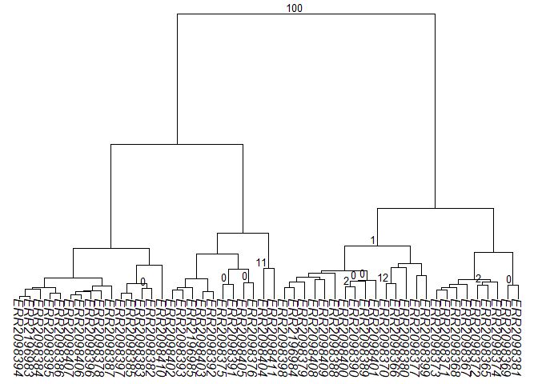

### COG

#### SCG

``` r
cluster.cog_scg.bray.upgma<-recluster.cons(cog_scg.bray, tr=100, p=0.5, method="average")

cluster.cog_scg.bray.upgma.boot<-recluster.boot(cluster.cog_scg.bray.upgma$cons, icm_cog_scg.ss.nocero,tr=100, p=0.5, method="average", boot=1000, level=1)
recluster.plot(cluster.cog_scg.bray.upgma$cons,cluster.cog_scg.bray.upgma.boot)
```

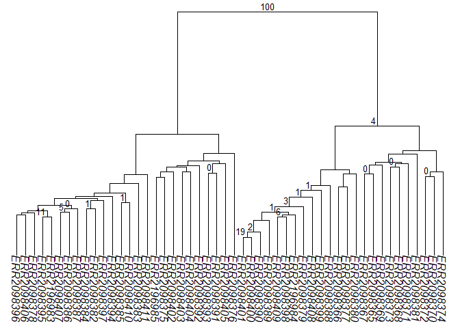

#### Meta

``` r
cluster.cog_meta.bray.upgma<-recluster.cons(cog_meta.bray, tr=100, p=0.5, method="average")

cluster.cog_meta.bray.upgma.boot<-recluster.boot(cluster.cog_meta.bray.upgma$cons, icm_cog_meta.ss.nocero,tr=100, p=0.5, method="average", boot=1000, level=1)
recluster.plot(cluster.cog_meta.bray.upgma$cons,cluster.cog_meta.bray.upgma.boot)
```

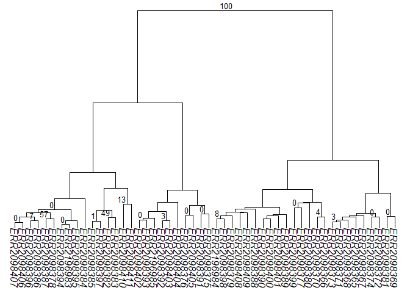

### PFAM

#### SCG

``` r
cluster.pfam_scg.bray.upgma<-recluster.cons(pfam_scg.bray, tr=100, p=0.5, method="average")

cluster.pfam_scg.bray.upgma.boot<-recluster.boot(cluster.pfam_scg.bray.upgma$cons, icm_pfam_scg.ss.nocero,tr=100, p=0.5, method="average", boot=1000, level=1)
recluster.plot(cluster.pfam_scg.bray.upgma$cons,cluster.pfam_scg.bray.upgma.boot)
```

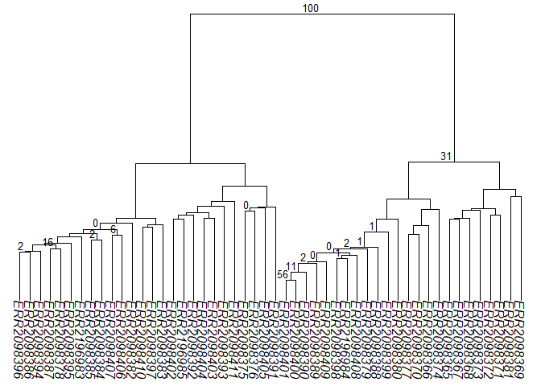

#### Meta

``` r
cluster.pfam_meta.bray.upgma<-recluster.cons(pfam_meta.bray, tr=100, p=0.5, method="average")

cluster.pfam_meta.bray.upgma.boot<-recluster.boot(cluster.pfam_meta.bray.upgma$cons, icm_pfam_meta.ss.nocero,tr=100, p=0.5, method="average", boot=1000, level=1)
recluster.plot(cluster.pfam_meta.bray.upgma$cons,cluster.pfam_meta.bray.upgma.boot)
```

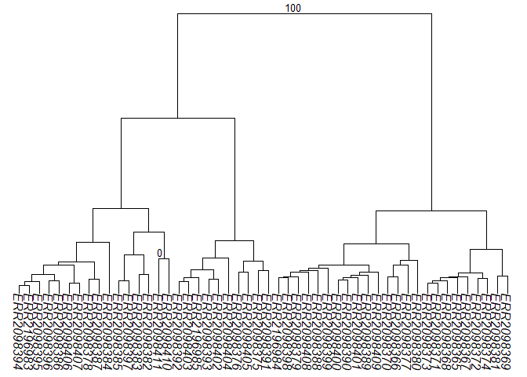
