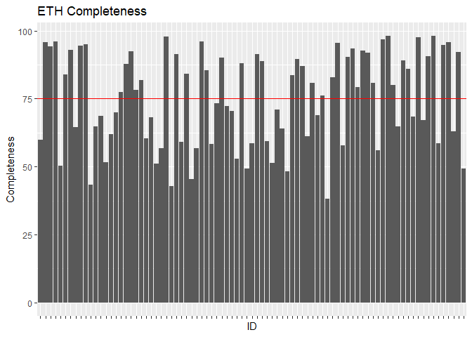
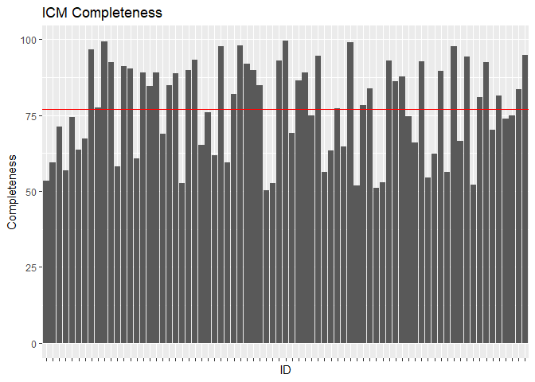
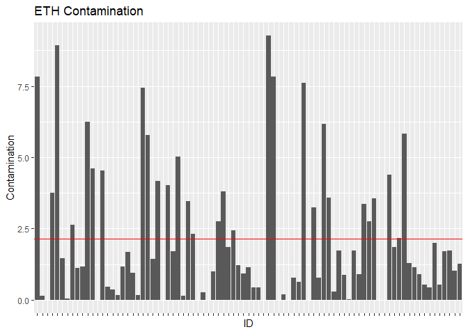
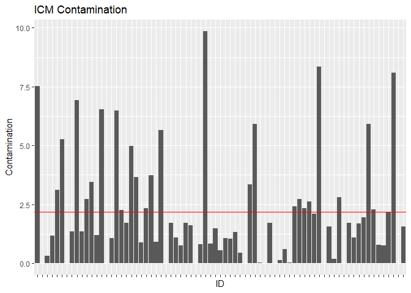
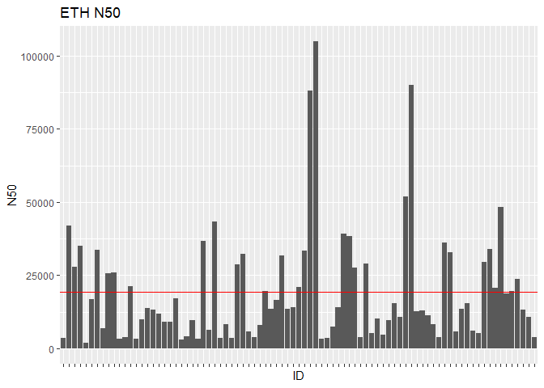
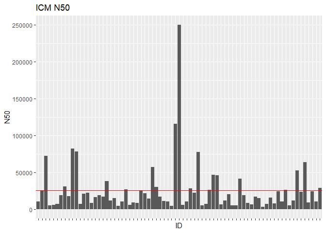
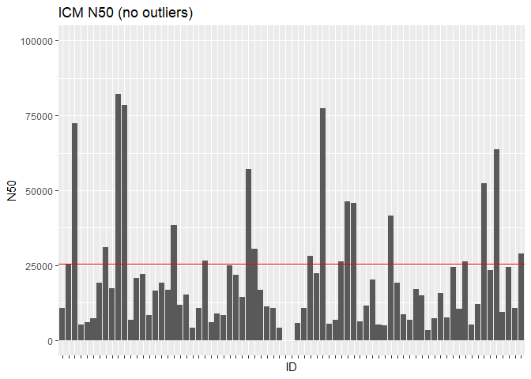

MAGs analysis
================
Sergio Gozalo
9 de febrero de 2021

## Libraries

``` r
library("tidyr")
library("dplyr")
```

    ## 
    ## Attaching package: 'dplyr'

    ## The following objects are masked from 'package:stats':
    ## 
    ##     filter, lag

    ## The following objects are masked from 'package:base':
    ## 
    ##     intersect, setdiff, setequal, union

``` r
library("ggplot2")
```

## Table reading

``` r
eth <- read.csv("MAGs/ETH/MAGs_EMOSE_summary.fixed.csv", header = TRUE, sep = ";")
icm <- read.csv("MAGs/ICM/Mags_ICM_75.csv", header = TRUE, sep = ";")
```

# Select variables of interest

``` r
#ETH
representative <- as.data.frame(distinct(eth[13]))
representative <- representative %>%
  separate(Representative.MAG, c("Rep", NA), ".fa")
representative <- as.list(as.data.frame(t(representative)))
eth <- subset(eth, MAG.Id %in% representative, .keep_all = TRUE)

eth <- eth %>%
  select(1,4,5,10, 16)
colnames(eth) <- c("ID", "Completeness", "Contamination", "Taxonomy", "N50")
eth <- eth %>% 
  mutate(Completeness = as.numeric(gsub(",",".",Completeness,fixed=TRUE)),
         Contamination = as.numeric(gsub(",",".",Contamination,fixed=TRUE)),
         N50 = as.numeric(gsub(",",".",N50,fixed=TRUE)))

#ICM
icm <- icm %>%
  select(1,4,14,15,22)
colnames(icm) <- c("ID", "Taxonomy", "Completeness", "Contamination", "N50")
icm <- icm[-1,]
```

# Completeness

``` r
#ETH
ethmeanct <-  sum(as.numeric(eth$Completeness))/nrow(eth)
ethplotct <- ggplot(eth, aes(y = Completeness, x = ID)) + geom_col() + theme(axis.text.x = element_blank()) + geom_hline(yintercept = ethmeanct, col = "red") + ggtitle("ETH Completeness")
ethplotct
```



``` r
#ICM
icmmeanct <- sum(icm$Completeness)/nrow(icm)
icmplotct <- ggplot(icm, aes(y = Completeness, x = ID)) + geom_col() + theme(axis.text.x = element_blank()) + geom_hline(yintercept = icmmeanct, col = "red") + ggtitle("ICM Completeness")
icmplotct
```



Las diferencias en e cuanto a completeness son muy pequeñas, ETH mean = 75.10871 e ICM mean = 76.96267, lo que no creo que sea una diferencia muy destacable. Por otra parte, los datos del ICM se ven mas consistentes, el rango de valores en los que se mueve la "Completeness" es mas estable.

# Contamination

``` r
#ETH
ethmeanco <-  sum(as.numeric(eth$Contamination))/nrow(eth)
ethplotco <- ggplot(eth, aes(y = Contamination, x = ID)) + geom_col() + theme(axis.text.x = element_blank()) + geom_hline(yintercept = ethmeanco, col = "red") + ggtitle("ETH Contamination")
ethplotco
```



``` r
#ICM
icmmeanco <- sum(icm$Contamination)/nrow(icm)
icmplotco <- ggplot(icm, aes(y = Contamination, x = ID)) + geom_col() + theme(axis.text.x = element_blank()) + geom_hline(yintercept = icmmeanco, col = "red") + ggtitle("ICM Contamination")
icmplotco
```



Respecto a la contaminacion, no se observan muchas diferencias.

# N50

``` r
#ETH
ethmeann <-  sum(as.numeric(eth$N50))/nrow(eth)
ethplotn <- ggplot(eth, aes(y = N50, x = ID)) + geom_col() + theme(axis.text.x = element_blank()) + geom_hline(yintercept = ethmeann, col = "red") + ggtitle("ETH N50")
ethplotn
```



``` r
#ICM
icmmeann <- sum(icm$N50)/nrow(icm)
icmplotn <- ggplot(icm, aes(y = N50, x = ID)) + geom_col() + theme(axis.text.x = element_blank()) + geom_hline(yintercept = icmmeann, col = "red") + ggtitle("ICM N50")
icmplotn
```



``` r
icmplotres <- ggplot(icm, aes(y = N50, x = ID)) + geom_col() + theme(axis.text.x = element_blank()) + geom_hline(yintercept = icmmeann, col = "red") + ggtitle("ICM N50 (no outliers)") + ylim(0, 100000)
icmplotres
```

    ## Warning: Removed 2 rows containing missing values (position_stack).



En referencia al N50 es donde más diferencias se ven, la media del ETH = 19320 y la del ICM = 25482, aqui si que se ve que la diferencia es bastante considerable.

# Conclusión

Con estas comparaciones en mente, creo que seria mejor usar los datos del ICM ya que son superiores en cuanto a lo completo que son los MAGs representativos, tienen un N50 bastante superior y todo esto sin aumentar la contaminación.
