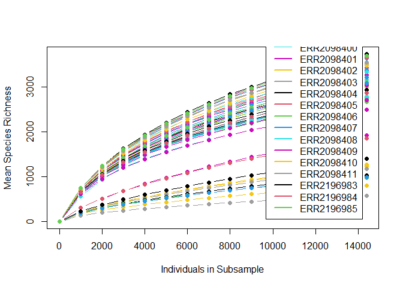
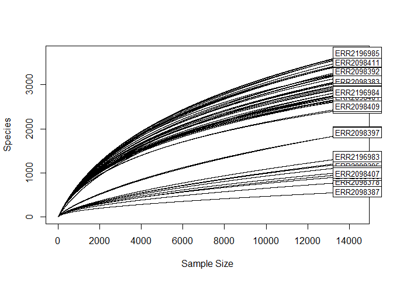
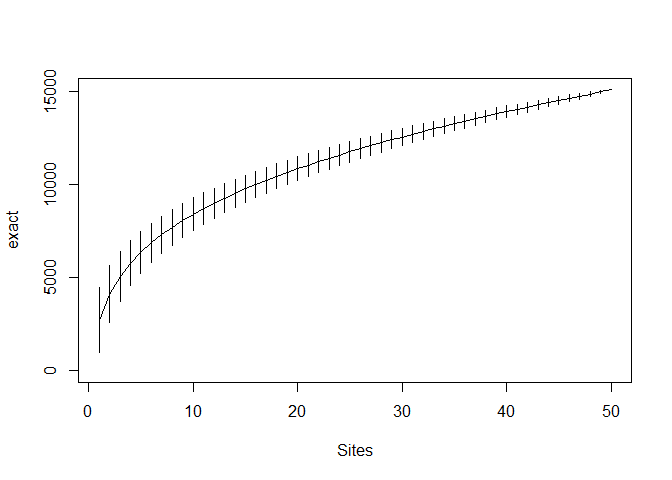
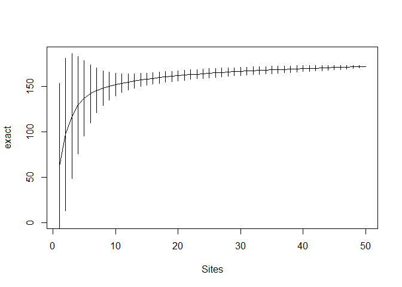
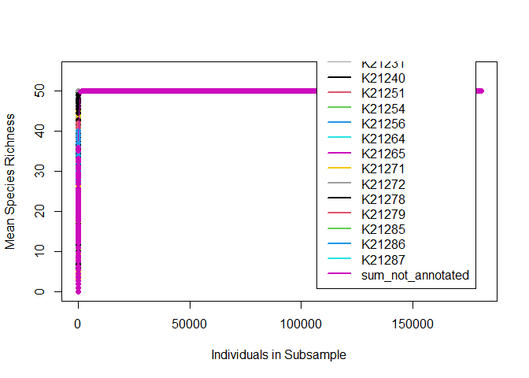
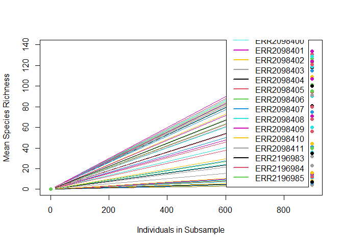

Diversity\_analysis
================
Sergio Gozalo
5 de abril de 2021

## Loading necessary libraries

``` r
library("vegan")
```

    ## Loading required package: permute

    ## Loading required package: lattice

    ## This is vegan 2.5-7

``` r
library("ggplot2")
library("tidyr")
library("plyr")
library("dplyr")
```

    ## 
    ## Attaching package: 'dplyr'

    ## The following objects are masked from 'package:plyr':
    ## 
    ##     arrange, count, desc, failwith, id, mutate, rename, summarise,
    ##     summarize

    ## The following objects are masked from 'package:stats':
    ## 
    ##     filter, lag

    ## The following objects are masked from 'package:base':
    ## 
    ##     intersect, setdiff, setequal, union

``` r
library("reshape2")
```

    ## 
    ## Attaching package: 'reshape2'

    ## The following object is masked from 'package:tidyr':
    ## 
    ##     smiths

``` r
library("randomcoloR")
```

# Tables

``` r
#ICM
f_kegg_scg <- (read.table("functional.tables/EMOSE-GC_ICM_250bp_KEGG.ko.lengthNorm.SCGnorm.counts.tbl", header = TRUE, sep = "\t", row.names = 1))

f_kegg_scgt <- t(f_kegg_scg)

f_kegg_mgn <- (read.table("functional.tables/EMOSE-GC_ICM_250bp_KEGG.ko.lengthNorm.metaGsizeNorm.counts.tbl", header = TRUE, sep = "\t", row.names = 1))

f_kegg_mgnt <- t(f_kegg_scg)

icm_cog_scg <- (read.table("functional.tables/EMOSE-GC_ICM_250bp_COG.lengthNorm.SCGnorm.counts.tbl", header = TRUE, sep = "\t", row.names = 1))

icm_pfam_scg <- (read.table("functional.tables/EMOSE-GC_ICM_250bp_pfam.lengthNorm.SCGnorm.counts.tbl", header = TRUE, sep = "\t", row.names = 1))

otu_mitags <- (read.delim("functional.tables/otu_table97.txt", header = TRUE, sep = "\t"))
otu_mitags$OTUId <- NULL
otu_mitags <- t(otu_mitags)
```

## Richness MiTags

``` r
otu_mitags_ss <- rrarefy(otu_mitags, min(rowSums(otu_mitags)))
richness <- estimateR(otu_mitags_ss)
richness
```

    ##          ERR2098365 ERR2098366 ERR2098367 ERR2098368 ERR2098369 ERR2098370
    ## S.obs    3398.00000 3333.00000 3319.00000 3172.00000 3249.00000 2996.00000
    ## S.chao1  5628.76720 5447.35897 5472.26565 4942.85793 5007.67978 4704.01242
    ## se.chao1  153.33270  148.52397  152.47774  128.85225  128.72608  129.70604
    ## S.ACE    5758.18715 5474.77460 5426.03687 5048.10768 4942.81079 4689.35679
    ## se.ACE     44.29927   42.47575   42.08026   39.95095   38.98195   38.19437
    ##          ERR2098371 ERR2098372 ERR2098373 ERR2098374 ERR2098375 ERR2098376
    ## S.obs    3050.00000 3136.00000 2973.00000 3023.00000 3154.00000 2921.00000
    ## S.chao1  4740.23256 4943.55599 4410.63158 4597.56505 4841.79087 4562.41978
    ## se.chao1  129.45334  133.61081  110.76294  119.03603  125.09046  121.59819
    ## S.ACE    4590.09882 4910.68553 4461.41487 4650.55305 4796.18969 4703.64401
    ## se.ACE     36.99044   39.26613   36.37079   37.85006   37.84666   39.01197
    ##          ERR2098377 ERR2098378 ERR2098379 ERR2098380 ERR2098381 ERR2098382
    ## S.obs    3077.00000  808.00000 2844.00000 2790.00000  3354.0000 3122.00000
    ## S.chao1  4859.82520 1830.12264 4429.36667 4012.64008  5035.3529 4432.88737
    ## se.chao1  133.53877  140.61304  124.81312   98.71152   120.0898   98.92488
    ## S.ACE    4806.97499 2015.78802 4379.25889 4065.78044  5131.1663 4540.72628
    ## se.ACE     38.22938   30.47513   36.45441   33.94566    39.6688   36.34978
    ##          ERR2098383 ERR2098384 ERR2098385 ERR2098386 ERR2098387 ERR2098388
    ## S.obs    3082.00000 2687.00000 1928.00000 1244.00000  578.00000 2914.00000
    ## S.chao1  4839.57143 3670.07200 3956.29573 2770.01562 1357.04412 4724.82022
    ## se.chao1  128.81029   82.54027  169.72022  160.52388  130.54681  139.63836
    ## S.ACE    4880.66091 3770.33825 4359.52351 3204.19769 1440.79943 4645.30681
    ## se.ACE     40.22799   32.38430   43.34324   38.58671   24.96395   38.03381
    ##          ERR2098389 ERR2098390 ERR2098391 ERR2098392 ERR2098393 ERR2098394
    ## S.obs    2832.00000 2797.00000 3605.00000 3320.00000 3680.00000 1267.00000
    ## S.chao1  4642.17258 4408.24270 5567.54416 4531.43879 5569.62613 3125.13953
    ## se.chao1  141.89420  126.91506  133.40686   91.09386  127.46953  197.73755
    ## S.ACE    4545.76060 4413.74652 5677.07999 4631.82506 5702.53531 3395.63477
    ## se.ACE     37.94357   37.02736   42.29557   35.40306   41.85798   39.36739
    ##          ERR2098395 ERR2098396 ERR2098397 ERR2098398 ERR2098399 ERR2098400
    ## S.obs    1162.00000 1044.00000  1920.0000 2711.00000 2749.00000 2852.00000
    ## S.chao1  2498.55495 2193.50625  3621.4087 4214.69142 4207.55204 4466.76734
    ## se.chao1  146.11531  134.45544   144.0817  121.18269  117.29483  126.96192
    ## S.ACE    2853.61332 2423.16405  3899.7259 4228.03339 4203.30475 4406.88200
    ## se.ACE     35.97161   31.88688    41.4280   36.22344   35.87349   36.59833
    ##          ERR2098401 ERR2098402 ERR2098403 ERR2098404 ERR2098405 ERR2098406
    ## S.obs     2732.0000 3514.00000 3542.00000 3716.00000 3697.00000  945.00000
    ## S.chao1   4105.1026 5309.23520 5370.04878 5729.81902 6150.68114 2106.84496
    ## se.chao1   110.4913  125.75944  127.16242  135.04746  162.90548  146.34230
    ## S.ACE     4179.8372 5300.87142 5375.57983 5742.71426 6081.90642 2293.29186
    ## se.ACE      35.4183   39.59328   40.08092   41.68257   44.02778   30.80064
    ##          ERR2098407 ERR2098408 ERR2098409 ERR2098410 ERR2098411 ERR2196983
    ## S.obs     997.00000 2481.00000 2517.00000  3531.0000 3518.00000 1375.00000
    ## S.chao1  2498.20472 3719.89175 3984.48670  5477.2834 5518.08606 3339.30102
    ## se.chao1  183.62071  107.00095  124.03049   132.9014  139.18728  197.85972
    ## S.ACE    2763.66406 3696.85320 3905.76432  5548.1350 5446.91190 3733.84460
    ## se.ACE     36.18869   33.13681   34.29559    41.5183   40.41756   42.31931
    ##          ERR2196984 ERR2196985
    ## S.obs    2840.00000 3728.00000
    ## S.chao1  4420.89474 5725.34901
    ## se.chao1  122.44220  133.71655
    ## S.ACE    4503.58369 5817.15389
    ## se.ACE     38.07808   42.69425

## Rarefaction MiTags

``` r
otu_rare <- rarefaction(otu_mitags_ss)
```



    ## [1] "rarefaction by J. Jacobs, last update April 17, 2009"

## Rarecurve MiTags

``` r
otu_rcurve <- rarecurve(otu_mitags_ss)
```



## Acumulation curve MiTags

``` r
otu_acc <- specaccum(otu_mitags_ss, method = "exact", permutations = 1000)
```

    ## Warning in cor(x > 0): the standard deviation is zero

``` r
plot(otu_acc)
```



## Richness KEGG

``` r
f_keg <- as.data.frame(f_kegg_scg)
f_keg[,1:50] <- sapply(f_keg[, c(1:50)], as.integer)
length(f_keg)
```

    ## [1] 50

``` r
richness <- estimateR(f_keg)


f_kegt <- as.data.frame(f_kegg_scgt)
f_kegt[,1:6965] <- sapply(f_kegt[, c(1:6965)], as.integer)
length(f_kegt)
```

    ## [1] 6965

``` r
richnesst <- estimateR(f_kegt)
```

## Rarefaction KEGG

### SCG + trans

``` r
kegg_ss <- rrarefy(f_kegt, min(rowSums(f_kegt)))
kegg_rare <- rarefaction(kegg_ss)
```



    ## [1] "rarefaction by J. Jacobs, last update April 17, 2009"

### SCG + no trans

``` r
# kegg_ss <- rrarefy(f_keg, min(rowSums(f_keg))) 
# No rrarefy porque l minimo es 0

kegg_rare <- rarefaction(f_keg)
```

    ## Warning in rarefy(x, select.c, se = T): requested 'sample' was larger than
    ## smallest site maximum (0)

    ## Warning in rarefy(x, select.c, se = T): requested 'sample' was larger than
    ## smallest site maximum (0)

    ## Warning in rarefy(x, select.c, se = T): requested 'sample' was larger than
    ## smallest site maximum (0)

    ## Warning in rarefy(x, select.c, se = T): requested 'sample' was larger than
    ## smallest site maximum (0)

    ## Warning in rarefy(x, select.c, se = T): requested 'sample' was larger than
    ## smallest site maximum (0)

    ## Warning in rarefy(x, select.c, se = T): requested 'sample' was larger than
    ## smallest site maximum (0)

    ## Warning in rarefy(x, select.c, se = T): requested 'sample' was larger than
    ## smallest site maximum (0)

    ## Warning in rarefy(x, select.c, se = T): requested 'sample' was larger than
    ## smallest site maximum (0)

    ## Warning in rarefy(x, select.c, se = T): requested 'sample' was larger than
    ## smallest site maximum (0)

    ## Warning in rarefy(x, select.c, se = T): requested 'sample' was larger than
    ## smallest site maximum (0)

    ## Warning in rarefy(x, select.c, se = T): requested 'sample' was larger than
    ## smallest site maximum (0)

    ## Warning in rarefy(x, select.c, se = T): requested 'sample' was larger than
    ## smallest site maximum (0)

    ## Warning in rarefy(x, select.c, se = T): requested 'sample' was larger than
    ## smallest site maximum (0)

    ## Warning in rarefy(x, select.c, se = T): requested 'sample' was larger than
    ## smallest site maximum (0)

    ## Warning in rarefy(x, select.c, se = T): requested 'sample' was larger than
    ## smallest site maximum (0)

    ## Warning in rarefy(x, select.c, se = T): requested 'sample' was larger than
    ## smallest site maximum (0)

    ## Warning in rarefy(x, select.c, se = T): requested 'sample' was larger than
    ## smallest site maximum (0)

    ## Warning in rarefy(x, select.c, se = T): requested 'sample' was larger than
    ## smallest site maximum (0)

    ## Warning in rarefy(x, select.c, se = T): requested 'sample' was larger than
    ## smallest site maximum (0)

    ## Warning in rarefy(x, select.c, se = T): requested 'sample' was larger than
    ## smallest site maximum (0)

    ## Warning in rarefy(x, select.c, se = T): requested 'sample' was larger than
    ## smallest site maximum (0)

    ## Warning in rarefy(x, select.c, se = T): requested 'sample' was larger than
    ## smallest site maximum (0)

    ## Warning in rarefy(x, select.c, se = T): requested 'sample' was larger than
    ## smallest site maximum (0)

    ## Warning in rarefy(x, select.c, se = T): requested 'sample' was larger than
    ## smallest site maximum (0)

    ## Warning in rarefy(x, select.c, se = T): requested 'sample' was larger than
    ## smallest site maximum (0)

    ## Warning in rarefy(x, select.c, se = T): requested 'sample' was larger than
    ## smallest site maximum (0)

    ## Warning in rarefy(x, select.c, se = T): requested 'sample' was larger than
    ## smallest site maximum (0)

    ## Warning in rarefy(x, select.c, se = T): requested 'sample' was larger than
    ## smallest site maximum (0)

    ## Warning in rarefy(x, select.c, se = T): requested 'sample' was larger than
    ## smallest site maximum (0)

    ## Warning in rarefy(x, select.c, se = T): requested 'sample' was larger than
    ## smallest site maximum (0)

    ## Warning in rarefy(x, select.c, se = T): requested 'sample' was larger than
    ## smallest site maximum (0)

    ## Warning in rarefy(x, select.c, se = T): requested 'sample' was larger than
    ## smallest site maximum (0)

    ## Warning in rarefy(x, select.c, se = T): requested 'sample' was larger than
    ## smallest site maximum (0)

    ## Warning in rarefy(x, select.c, se = T): requested 'sample' was larger than
    ## smallest site maximum (0)

    ## Warning in rarefy(x, select.c, se = T): requested 'sample' was larger than
    ## smallest site maximum (0)

    ## Warning in rarefy(x, select.c, se = T): requested 'sample' was larger than
    ## smallest site maximum (0)

    ## Warning in rarefy(x, select.c, se = T): requested 'sample' was larger than
    ## smallest site maximum (0)

    ## Warning in rarefy(x, select.c, se = T): requested 'sample' was larger than
    ## smallest site maximum (0)

    ## Warning in rarefy(x, select.c, se = T): requested 'sample' was larger than
    ## smallest site maximum (0)

    ## Warning in rarefy(x, select.c, se = T): requested 'sample' was larger than
    ## smallest site maximum (0)

    ## Warning in rarefy(x, select.c, se = T): requested 'sample' was larger than
    ## smallest site maximum (0)

    ## Warning in rarefy(x, select.c, se = T): requested 'sample' was larger than
    ## smallest site maximum (0)

    ## Warning in rarefy(x, select.c, se = T): requested 'sample' was larger than
    ## smallest site maximum (0)

    ## Warning in rarefy(x, select.c, se = T): requested 'sample' was larger than
    ## smallest site maximum (0)

    ## Warning in rarefy(x, select.c, se = T): requested 'sample' was larger than
    ## smallest site maximum (0)

    ## Warning in rarefy(x, select.c, se = T): requested 'sample' was larger than
    ## smallest site maximum (0)

    ## Warning in rarefy(x, select.c, se = T): requested 'sample' was larger than
    ## smallest site maximum (0)

    ## Warning in rarefy(x, select.c, se = T): requested 'sample' was larger than
    ## smallest site maximum (0)

    ## Warning in rarefy(x, select.c, se = T): requested 'sample' was larger than
    ## smallest site maximum (0)

    ## Warning in rarefy(x, select.c, se = T): requested 'sample' was larger than
    ## smallest site maximum (0)

    ## Warning in rarefy(x, select.c, se = T): requested 'sample' was larger than
    ## smallest site maximum (0)

    ## Warning in rarefy(x, select.c, se = T): requested 'sample' was larger than
    ## smallest site maximum (0)

    ## Warning in rarefy(x, select.c, se = T): requested 'sample' was larger than
    ## smallest site maximum (0)

    ## Warning in rarefy(x, select.c, se = T): requested 'sample' was larger than
    ## smallest site maximum (0)

    ## Warning in rarefy(x, select.c, se = T): requested 'sample' was larger than
    ## smallest site maximum (0)

    ## Warning in rarefy(x, select.c, se = T): requested 'sample' was larger than
    ## smallest site maximum (0)

    ## Warning in rarefy(x, select.c, se = T): requested 'sample' was larger than
    ## smallest site maximum (0)

    ## Warning in rarefy(x, select.c, se = T): requested 'sample' was larger than
    ## smallest site maximum (0)

    ## Warning in rarefy(x, select.c, se = T): requested 'sample' was larger than
    ## smallest site maximum (0)

    ## Warning in rarefy(x, select.c, se = T): requested 'sample' was larger than
    ## smallest site maximum (0)

    ## Warning in rarefy(x, select.c, se = T): requested 'sample' was larger than
    ## smallest site maximum (0)

    ## Warning in rarefy(x, select.c, se = T): requested 'sample' was larger than
    ## smallest site maximum (0)

    ## Warning in rarefy(x, select.c, se = T): requested 'sample' was larger than
    ## smallest site maximum (0)

    ## Warning in rarefy(x, select.c, se = T): requested 'sample' was larger than
    ## smallest site maximum (0)

    ## Warning in rarefy(x, select.c, se = T): requested 'sample' was larger than
    ## smallest site maximum (0)

    ## Warning in rarefy(x, select.c, se = T): requested 'sample' was larger than
    ## smallest site maximum (0)

    ## Warning in rarefy(x, select.c, se = T): requested 'sample' was larger than
    ## smallest site maximum (0)

    ## Warning in rarefy(x, select.c, se = T): requested 'sample' was larger than
    ## smallest site maximum (0)

    ## Warning in rarefy(x, select.c, se = T): requested 'sample' was larger than
    ## smallest site maximum (0)

    ## Warning in rarefy(x, select.c, se = T): requested 'sample' was larger than
    ## smallest site maximum (0)

    ## Warning in rarefy(x, select.c, se = T): requested 'sample' was larger than
    ## smallest site maximum (0)

    ## Warning in rarefy(x, select.c, se = T): requested 'sample' was larger than
    ## smallest site maximum (0)

    ## Warning in rarefy(x, select.c, se = T): requested 'sample' was larger than
    ## smallest site maximum (0)

    ## Warning in rarefy(x, select.c, se = T): requested 'sample' was larger than
    ## smallest site maximum (0)

    ## Warning in rarefy(x, select.c, se = T): requested 'sample' was larger than
    ## smallest site maximum (0)

    ## Warning in rarefy(x, select.c, se = T): requested 'sample' was larger than
    ## smallest site maximum (0)

    ## Warning in rarefy(x, select.c, se = T): requested 'sample' was larger than
    ## smallest site maximum (0)

    ## Warning in rarefy(x, select.c, se = T): requested 'sample' was larger than
    ## smallest site maximum (0)

    ## Warning in rarefy(x, select.c, se = T): requested 'sample' was larger than
    ## smallest site maximum (0)

    ## Warning in rarefy(x, select.c, se = T): requested 'sample' was larger than
    ## smallest site maximum (0)

    ## Warning in rarefy(x, select.c, se = T): requested 'sample' was larger than
    ## smallest site maximum (0)

    ## Warning in rarefy(x, select.c, se = T): requested 'sample' was larger than
    ## smallest site maximum (0)

    ## Warning in rarefy(x, select.c, se = T): requested 'sample' was larger than
    ## smallest site maximum (0)

    ## Warning in rarefy(x, select.c, se = T): requested 'sample' was larger than
    ## smallest site maximum (0)

    ## Warning in rarefy(x, select.c, se = T): requested 'sample' was larger than
    ## smallest site maximum (0)

    ## Warning in rarefy(x, select.c, se = T): requested 'sample' was larger than
    ## smallest site maximum (0)

    ## Warning in rarefy(x, select.c, se = T): requested 'sample' was larger than
    ## smallest site maximum (0)

    ## Warning in rarefy(x, select.c, se = T): requested 'sample' was larger than
    ## smallest site maximum (0)

    ## Warning in rarefy(x, select.c, se = T): requested 'sample' was larger than
    ## smallest site maximum (0)

    ## Warning in rarefy(x, select.c, se = T): requested 'sample' was larger than
    ## smallest site maximum (0)

    ## Warning in rarefy(x, select.c, se = T): requested 'sample' was larger than
    ## smallest site maximum (0)

    ## Warning in rarefy(x, select.c, se = T): requested 'sample' was larger than
    ## smallest site maximum (0)

    ## Warning in rarefy(x, select.c, se = T): requested 'sample' was larger than
    ## smallest site maximum (0)

    ## Warning in rarefy(x, select.c, se = T): requested 'sample' was larger than
    ## smallest site maximum (0)

    ## Warning in rarefy(x, select.c, se = T): requested 'sample' was larger than
    ## smallest site maximum (0)

    ## Warning in rarefy(x, select.c, se = T): requested 'sample' was larger than
    ## smallest site maximum (0)

    ## Warning in rarefy(x, select.c, se = T): requested 'sample' was larger than
    ## smallest site maximum (0)

    ## Warning in rarefy(x, select.c, se = T): requested 'sample' was larger than
    ## smallest site maximum (0)

    ## Warning in rarefy(x, select.c, se = T): requested 'sample' was larger than
    ## smallest site maximum (0)

    ## Warning in rarefy(x, select.c, se = T): requested 'sample' was larger than
    ## smallest site maximum (0)

    ## Warning in rarefy(x, select.c, se = T): requested 'sample' was larger than
    ## smallest site maximum (0)

    ## Warning in rarefy(x, select.c, se = T): requested 'sample' was larger than
    ## smallest site maximum (0)

    ## Warning in rarefy(x, select.c, se = T): requested 'sample' was larger than
    ## smallest site maximum (0)

    ## Warning in rarefy(x, select.c, se = T): requested 'sample' was larger than
    ## smallest site maximum (0)

    ## Warning in rarefy(x, select.c, se = T): requested 'sample' was larger than
    ## smallest site maximum (0)

    ## Warning in rarefy(x, select.c, se = T): requested 'sample' was larger than
    ## smallest site maximum (0)

    ## Warning in rarefy(x, select.c, se = T): requested 'sample' was larger than
    ## smallest site maximum (0)

    ## Warning in rarefy(x, select.c, se = T): requested 'sample' was larger than
    ## smallest site maximum (0)

    ## Warning in rarefy(x, select.c, se = T): requested 'sample' was larger than
    ## smallest site maximum (0)

    ## Warning in rarefy(x, select.c, se = T): requested 'sample' was larger than
    ## smallest site maximum (0)

    ## Warning in rarefy(x, select.c, se = T): requested 'sample' was larger than
    ## smallest site maximum (0)

    ## Warning in rarefy(x, select.c, se = T): requested 'sample' was larger than
    ## smallest site maximum (0)

    ## Warning in rarefy(x, select.c, se = T): requested 'sample' was larger than
    ## smallest site maximum (0)

    ## Warning in rarefy(x, select.c, se = T): requested 'sample' was larger than
    ## smallest site maximum (0)

    ## Warning in rarefy(x, select.c, se = T): requested 'sample' was larger than
    ## smallest site maximum (0)

    ## Warning in rarefy(x, select.c, se = T): requested 'sample' was larger than
    ## smallest site maximum (0)

    ## Warning in rarefy(x, select.c, se = T): requested 'sample' was larger than
    ## smallest site maximum (0)

    ## Warning in rarefy(x, select.c, se = T): requested 'sample' was larger than
    ## smallest site maximum (0)

    ## Warning in rarefy(x, select.c, se = T): requested 'sample' was larger than
    ## smallest site maximum (0)

    ## Warning in rarefy(x, select.c, se = T): requested 'sample' was larger than
    ## smallest site maximum (0)

    ## Warning in rarefy(x, select.c, se = T): requested 'sample' was larger than
    ## smallest site maximum (0)

    ## Warning in rarefy(x, select.c, se = T): requested 'sample' was larger than
    ## smallest site maximum (0)

    ## Warning in rarefy(x, select.c, se = T): requested 'sample' was larger than
    ## smallest site maximum (0)

    ## Warning in rarefy(x, select.c, se = T): requested 'sample' was larger than
    ## smallest site maximum (0)

    ## Warning in rarefy(x, select.c, se = T): requested 'sample' was larger than
    ## smallest site maximum (0)

    ## Warning in rarefy(x, select.c, se = T): requested 'sample' was larger than
    ## smallest site maximum (0)

    ## Warning in rarefy(x, select.c, se = T): requested 'sample' was larger than
    ## smallest site maximum (0)

    ## Warning in rarefy(x, select.c, se = T): requested 'sample' was larger than
    ## smallest site maximum (0)

    ## Warning in rarefy(x, select.c, se = T): requested 'sample' was larger than
    ## smallest site maximum (0)

    ## Warning in rarefy(x, select.c, se = T): requested 'sample' was larger than
    ## smallest site maximum (0)

    ## Warning in rarefy(x, select.c, se = T): requested 'sample' was larger than
    ## smallest site maximum (0)

    ## Warning in rarefy(x, select.c, se = T): requested 'sample' was larger than
    ## smallest site maximum (0)

    ## Warning in rarefy(x, select.c, se = T): requested 'sample' was larger than
    ## smallest site maximum (0)

    ## Warning in rarefy(x, select.c, se = T): requested 'sample' was larger than
    ## smallest site maximum (0)

    ## Warning in rarefy(x, select.c, se = T): requested 'sample' was larger than
    ## smallest site maximum (0)

    ## Warning in rarefy(x, select.c, se = T): requested 'sample' was larger than
    ## smallest site maximum (0)

    ## Warning in rarefy(x, select.c, se = T): requested 'sample' was larger than
    ## smallest site maximum (0)

    ## Warning in rarefy(x, select.c, se = T): requested 'sample' was larger than
    ## smallest site maximum (0)

    ## Warning in rarefy(x, select.c, se = T): requested 'sample' was larger than
    ## smallest site maximum (0)

    ## Warning in rarefy(x, select.c, se = T): requested 'sample' was larger than
    ## smallest site maximum (0)

    ## Warning in rarefy(x, select.c, se = T): requested 'sample' was larger than
    ## smallest site maximum (0)

    ## Warning in rarefy(x, select.c, se = T): requested 'sample' was larger than
    ## smallest site maximum (0)

    ## Warning in rarefy(x, select.c, se = T): requested 'sample' was larger than
    ## smallest site maximum (0)

    ## Warning in rarefy(x, select.c, se = T): requested 'sample' was larger than
    ## smallest site maximum (0)

    ## Warning in rarefy(x, select.c, se = T): requested 'sample' was larger than
    ## smallest site maximum (0)

    ## Warning in rarefy(x, select.c, se = T): requested 'sample' was larger than
    ## smallest site maximum (0)

    ## Warning in rarefy(x, select.c, se = T): requested 'sample' was larger than
    ## smallest site maximum (0)

    ## Warning in rarefy(x, select.c, se = T): requested 'sample' was larger than
    ## smallest site maximum (0)

    ## Warning in rarefy(x, select.c, se = T): requested 'sample' was larger than
    ## smallest site maximum (0)

    ## Warning in rarefy(x, select.c, se = T): requested 'sample' was larger than
    ## smallest site maximum (0)

    ## Warning in rarefy(x, select.c, se = T): requested 'sample' was larger than
    ## smallest site maximum (0)

    ## Warning in rarefy(x, select.c, se = T): requested 'sample' was larger than
    ## smallest site maximum (0)

    ## Warning in rarefy(x, select.c, se = T): requested 'sample' was larger than
    ## smallest site maximum (0)

    ## Warning in rarefy(x, select.c, se = T): requested 'sample' was larger than
    ## smallest site maximum (0)

    ## Warning in rarefy(x, select.c, se = T): requested 'sample' was larger than
    ## smallest site maximum (0)

    ## Warning in rarefy(x, select.c, se = T): requested 'sample' was larger than
    ## smallest site maximum (0)

    ## Warning in rarefy(x, select.c, se = T): requested 'sample' was larger than
    ## smallest site maximum (0)

    ## Warning in rarefy(x, select.c, se = T): requested 'sample' was larger than
    ## smallest site maximum (0)

    ## Warning in rarefy(x, select.c, se = T): requested 'sample' was larger than
    ## smallest site maximum (0)

    ## Warning in rarefy(x, select.c, se = T): requested 'sample' was larger than
    ## smallest site maximum (0)

    ## Warning in rarefy(x, select.c, se = T): requested 'sample' was larger than
    ## smallest site maximum (0)

    ## Warning in rarefy(x, select.c, se = T): requested 'sample' was larger than
    ## smallest site maximum (0)

    ## Warning in rarefy(x, select.c, se = T): requested 'sample' was larger than
    ## smallest site maximum (0)

    ## Warning in rarefy(x, select.c, se = T): requested 'sample' was larger than
    ## smallest site maximum (0)

    ## Warning in rarefy(x, select.c, se = T): requested 'sample' was larger than
    ## smallest site maximum (0)

    ## Warning in rarefy(x, select.c, se = T): requested 'sample' was larger than
    ## smallest site maximum (0)

    ## Warning in rarefy(x, select.c, se = T): requested 'sample' was larger than
    ## smallest site maximum (0)

    ## Warning in rarefy(x, select.c, se = T): requested 'sample' was larger than
    ## smallest site maximum (0)

    ## Warning in rarefy(x, select.c, se = T): requested 'sample' was larger than
    ## smallest site maximum (0)

    ## Warning in rarefy(x, select.c, se = T): requested 'sample' was larger than
    ## smallest site maximum (0)

    ## Warning in rarefy(x, select.c, se = T): requested 'sample' was larger than
    ## smallest site maximum (0)

    ## Warning in rarefy(x, select.c, se = T): requested 'sample' was larger than
    ## smallest site maximum (0)

    ## Warning in rarefy(x, select.c, se = T): requested 'sample' was larger than
    ## smallest site maximum (0)

    ## Warning in rarefy(x, select.c, se = T): requested 'sample' was larger than
    ## smallest site maximum (0)

    ## Warning in rarefy(x, select.c, se = T): requested 'sample' was larger than
    ## smallest site maximum (0)

    ## Warning in rarefy(x, select.c, se = T): requested 'sample' was larger than
    ## smallest site maximum (0)

    ## Warning in rarefy(x, select.c, se = T): requested 'sample' was larger than
    ## smallest site maximum (0)

    ## Warning in rarefy(x, select.c, se = T): requested 'sample' was larger than
    ## smallest site maximum (0)

    ## Warning in rarefy(x, select.c, se = T): requested 'sample' was larger than
    ## smallest site maximum (0)

    ## Warning in rarefy(x, select.c, se = T): requested 'sample' was larger than
    ## smallest site maximum (0)

    ## Warning in rarefy(x, select.c, se = T): requested 'sample' was larger than
    ## smallest site maximum (0)

    ## Warning in rarefy(x, select.c, se = T): requested 'sample' was larger than
    ## smallest site maximum (0)

    ## Warning in rarefy(x, select.c, se = T): requested 'sample' was larger than
    ## smallest site maximum (0)

    ## Warning in rarefy(x, select.c, se = T): requested 'sample' was larger than
    ## smallest site maximum (0)

    ## Warning in rarefy(x, select.c, se = T): requested 'sample' was larger than
    ## smallest site maximum (0)

    ## Warning in rarefy(x, select.c, se = T): requested 'sample' was larger than
    ## smallest site maximum (0)

    ## Warning in rarefy(x, select.c, se = T): requested 'sample' was larger than
    ## smallest site maximum (0)

    ## Warning in rarefy(x, select.c, se = T): requested 'sample' was larger than
    ## smallest site maximum (0)

    ## Warning in rarefy(x, select.c, se = T): requested 'sample' was larger than
    ## smallest site maximum (0)

    ## Warning in rarefy(x, select.c, se = T): requested 'sample' was larger than
    ## smallest site maximum (0)

    ## Warning in rarefy(x, select.c, se = T): requested 'sample' was larger than
    ## smallest site maximum (0)

    ## Warning in rarefy(x, select.c, se = T): requested 'sample' was larger than
    ## smallest site maximum (0)

    ## Warning in rarefy(x, select.c, se = T): requested 'sample' was larger than
    ## smallest site maximum (0)

    ## Warning in rarefy(x, select.c, se = T): requested 'sample' was larger than
    ## smallest site maximum (0)

    ## Warning in rarefy(x, select.c, se = T): requested 'sample' was larger than
    ## smallest site maximum (0)

    ## Warning in rarefy(x, select.c, se = T): requested 'sample' was larger than
    ## smallest site maximum (0)

    ## Warning in rarefy(x, select.c, se = T): requested 'sample' was larger than
    ## smallest site maximum (0)

    ## Warning in rarefy(x, select.c, se = T): requested 'sample' was larger than
    ## smallest site maximum (0)

    ## Warning in rarefy(x, select.c, se = T): requested 'sample' was larger than
    ## smallest site maximum (0)

    ## Warning in rarefy(x, select.c, se = T): requested 'sample' was larger than
    ## smallest site maximum (0)

    ## Warning in rarefy(x, select.c, se = T): requested 'sample' was larger than
    ## smallest site maximum (0)

    ## Warning in rarefy(x, select.c, se = T): requested 'sample' was larger than
    ## smallest site maximum (0)

    ## Warning in rarefy(x, select.c, se = T): requested 'sample' was larger than
    ## smallest site maximum (0)

    ## Warning in rarefy(x, select.c, se = T): requested 'sample' was larger than
    ## smallest site maximum (0)

    ## Warning in rarefy(x, select.c, se = T): requested 'sample' was larger than
    ## smallest site maximum (0)

    ## Warning in rarefy(x, select.c, se = T): requested 'sample' was larger than
    ## smallest site maximum (0)

    ## Warning in rarefy(x, select.c, se = T): requested 'sample' was larger than
    ## smallest site maximum (0)

    ## Warning in rarefy(x, select.c, se = T): requested 'sample' was larger than
    ## smallest site maximum (0)

    ## Warning in rarefy(x, select.c, se = T): requested 'sample' was larger than
    ## smallest site maximum (0)

    ## Warning in rarefy(x, select.c, se = T): requested 'sample' was larger than
    ## smallest site maximum (0)

    ## Warning in rarefy(x, select.c, se = T): requested 'sample' was larger than
    ## smallest site maximum (0)

    ## Warning in rarefy(x, select.c, se = T): requested 'sample' was larger than
    ## smallest site maximum (0)

    ## Warning in rarefy(x, select.c, se = T): requested 'sample' was larger than
    ## smallest site maximum (0)

    ## Warning in rarefy(x, select.c, se = T): requested 'sample' was larger than
    ## smallest site maximum (0)

    ## Warning in rarefy(x, select.c, se = T): requested 'sample' was larger than
    ## smallest site maximum (0)

    ## Warning in rarefy(x, select.c, se = T): requested 'sample' was larger than
    ## smallest site maximum (0)

    ## Warning in rarefy(x, select.c, se = T): requested 'sample' was larger than
    ## smallest site maximum (0)

    ## Warning in rarefy(x, select.c, se = T): requested 'sample' was larger than
    ## smallest site maximum (0)

    ## Warning in rarefy(x, select.c, se = T): requested 'sample' was larger than
    ## smallest site maximum (0)

    ## Warning in rarefy(x, select.c, se = T): requested 'sample' was larger than
    ## smallest site maximum (0)

    ## Warning in rarefy(x, select.c, se = T): requested 'sample' was larger than
    ## smallest site maximum (0)

    ## Warning in rarefy(x, select.c, se = T): requested 'sample' was larger than
    ## smallest site maximum (0)

    ## Warning in rarefy(x, select.c, se = T): requested 'sample' was larger than
    ## smallest site maximum (0)

    ## Warning in rarefy(x, select.c, se = T): requested 'sample' was larger than
    ## smallest site maximum (0)

    ## Warning in rarefy(x, select.c, se = T): requested 'sample' was larger than
    ## smallest site maximum (0)

    ## Warning in rarefy(x, select.c, se = T): requested 'sample' was larger than
    ## smallest site maximum (0)

    ## Warning in rarefy(x, select.c, se = T): requested 'sample' was larger than
    ## smallest site maximum (0)

    ## Warning in rarefy(x, select.c, se = T): requested 'sample' was larger than
    ## smallest site maximum (0)

    ## Warning in rarefy(x, select.c, se = T): requested 'sample' was larger than
    ## smallest site maximum (0)

    ## Warning in rarefy(x, select.c, se = T): requested 'sample' was larger than
    ## smallest site maximum (0)

    ## Warning in rarefy(x, select.c, se = T): requested 'sample' was larger than
    ## smallest site maximum (0)

    ## Warning in rarefy(x, select.c, se = T): requested 'sample' was larger than
    ## smallest site maximum (0)

    ## Warning in rarefy(x, select.c, se = T): requested 'sample' was larger than
    ## smallest site maximum (0)

    ## Warning in rarefy(x, select.c, se = T): requested 'sample' was larger than
    ## smallest site maximum (0)

    ## Warning in rarefy(x, select.c, se = T): requested 'sample' was larger than
    ## smallest site maximum (0)

    ## Warning in rarefy(x, select.c, se = T): requested 'sample' was larger than
    ## smallest site maximum (0)

    ## Warning in rarefy(x, select.c, se = T): requested 'sample' was larger than
    ## smallest site maximum (0)

    ## Warning in rarefy(x, select.c, se = T): requested 'sample' was larger than
    ## smallest site maximum (0)

    ## Warning in rarefy(x, select.c, se = T): requested 'sample' was larger than
    ## smallest site maximum (0)

    ## Warning in rarefy(x, select.c, se = T): requested 'sample' was larger than
    ## smallest site maximum (0)

    ## Warning in rarefy(x, select.c, se = T): requested 'sample' was larger than
    ## smallest site maximum (0)

    ## Warning in rarefy(x, select.c, se = T): requested 'sample' was larger than
    ## smallest site maximum (0)

    ## Warning in rarefy(x, select.c, se = T): requested 'sample' was larger than
    ## smallest site maximum (0)

    ## Warning in rarefy(x, select.c, se = T): requested 'sample' was larger than
    ## smallest site maximum (0)



    ## [1] "rarefaction by J. Jacobs, last update April 17, 2009"

``` r
f_kegg_mgn <- as.data.frame(f_kegg_mgn)
f_kegg_mgn[,1:50] <- sapply(f_kegg_mgn[, c(1:50)], as.integer)
length(f_kegg_mgn)
```

    ## [1] 50

``` r
richness <- estimateR(f_kegg_mgn)
```

    ## Warning in sqrt(sum(Deriv.Ch1 %*% t(Deriv.Ch1) * (diag(a) - a %*% t(a)/S.ACE))):
    ## Se han producido NaNs

    ## Warning in sqrt(sum(Deriv.Ch1 %*% t(Deriv.Ch1) * (diag(a) - a %*% t(a)/S.ACE))):
    ## Se han producido NaNs

``` r
f_kegg_mgnt <- as.data.frame(f_kegg_mgnt)
f_kegg_mgnt[,1:6965] <- sapply(f_kegg_mgnt[, c(1:6965)], as.integer)
length(f_kegg_mgnt)
```

    ## [1] 6965

``` r
richnesst <- estimateR(f_kegt)
```

### mgn + trans

``` r
kegg_ss <- rrarefy(f_kegg_mgnt, min(rowSums(f_kegg_mgnt)))
kegg_rare <- rarefaction(kegg_ss)
```



    ## [1] "rarefaction by J. Jacobs, last update April 17, 2009"

### mgn + no trans

``` r
# kegg_ss <- rrarefy(f_kegg_mgn, min(rowSums(f_kegg_mgn)))
#kegg_rare <- rarefaction(f_kegg_mgn)
```
