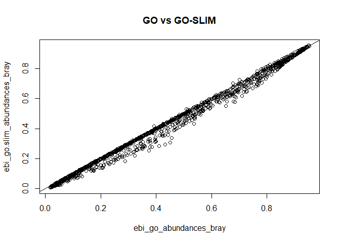
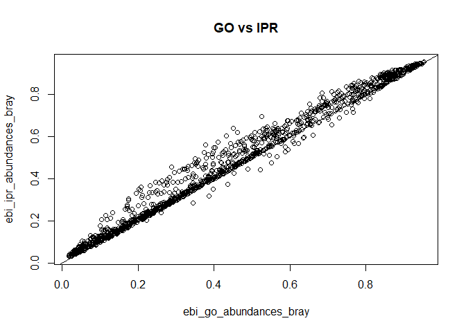
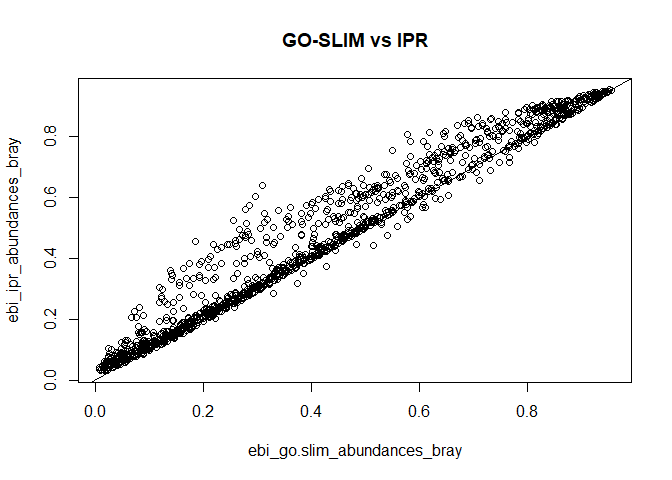

EBI\_Pipeline\_Comparisson
================
Sergio Gozalo
26 de febrero de 2021

## Loading necessary libraries

``` r
library("vegan")
```

    ## Loading required package: permute

    ## Loading required package: lattice

    ## This is vegan 2.5-7

``` r
library("ggplot2")
library("tidyr")
library("dplyr")
```

    ## 
    ## Attaching package: 'dplyr'

    ## The following objects are masked from 'package:stats':
    ## 
    ##     filter, lag

    ## The following objects are masked from 'package:base':
    ## 
    ##     intersect, setdiff, setequal, union

## Table reading

``` r
ebi_go_abundances <- read.table("functional.tables/ERP112966_GO_abundances_v4.1.tsv", header = TRUE, row.names = 1, sep ="\t")
ebi_go_abundances$description <- NULL #Need to remove this column to work
ebi_go_abundances$category <- NULL #Need to remove this column to work
ebi_go_abundances <- t(ebi_go_abundances)

ebi_go.slim_abundances <- read.table("functional.tables/ERP112966_GO-slim_abundances_v4.1.tsv", header = TRUE, row.names = 1, sep ="\t")
ebi_go.slim_abundances$description <- NULL
ebi_go.slim_abundances$category <- NULL
ebi_go.slim_abundances <- t(ebi_go.slim_abundances)

ebi_ipr_abundances <- read.table("functional.tables/ERP112966_IPR_abundances_v4.1.tsv", header = TRUE, row.names = 1, sep ="\t")
ebi_ipr_abundances$description <- NULL
ebi_ipr_abundances$category <- NULL
ebi_ipr_abundances <- t(ebi_ipr_abundances)
```

## Bray-Curtis dissmilarity matrix

``` r
ebi_go_abundances_bray <- vegdist(ebi_go_abundances, method="bray")

ebi_go.slim_abundances_bray <- vegdist(ebi_go.slim_abundances, method="bray")

ebi_ipr_abundances_bray <- vegdist(ebi_ipr_abundances, method="bray")
```

## Comparisson between the different databases

``` r
#Plots
plot(ebi_go_abundances_bray, ebi_go.slim_abundances_bray, main = "GO vs GO-SLIM")
abline(0,1)
```



``` r
plot(ebi_go_abundances_bray, ebi_ipr_abundances_bray, main = "GO vs IPR")
abline(0,1)
```



``` r
plot(ebi_go.slim_abundances_bray, ebi_ipr_abundances_bray, main = "GO-SLIM vs IPR")
abline(0,1)
```



``` r
#Mantel test for correlation
mantel(ebi_go_abundances_bray, ebi_go.slim_abundances_bray)
```

    ## 
    ## Mantel statistic based on Pearson's product-moment correlation 
    ## 
    ## Call:
    ## mantel(xdis = ebi_go_abundances_bray, ydis = ebi_go.slim_abundances_bray) 
    ## 
    ## Mantel statistic r: 0.9964 
    ##       Significance: 0.001 
    ## 
    ## Upper quantiles of permutations (null model):
    ##    90%    95%  97.5%    99% 
    ## 0.0913 0.1184 0.1457 0.1923 
    ## Permutation: free
    ## Number of permutations: 999

``` r
mantel(ebi_go_abundances_bray, ebi_ipr_abundances_bray)
```

    ## 
    ## Mantel statistic based on Pearson's product-moment correlation 
    ## 
    ## Call:
    ## mantel(xdis = ebi_go_abundances_bray, ydis = ebi_ipr_abundances_bray) 
    ## 
    ## Mantel statistic r: 0.9919 
    ##       Significance: 0.001 
    ## 
    ## Upper quantiles of permutations (null model):
    ##    90%    95%  97.5%    99% 
    ## 0.0978 0.1315 0.1720 0.2171 
    ## Permutation: free
    ## Number of permutations: 999

``` r
mantel(ebi_go.slim_abundances_bray, ebi_ipr_abundances_bray)
```

    ## 
    ## Mantel statistic based on Pearson's product-moment correlation 
    ## 
    ## Call:
    ## mantel(xdis = ebi_go.slim_abundances_bray, ydis = ebi_ipr_abundances_bray) 
    ## 
    ## Mantel statistic r: 0.979 
    ##       Significance: 0.001 
    ## 
    ## Upper quantiles of permutations (null model):
    ##    90%    95%  97.5%    99% 
    ## 0.0998 0.1336 0.1693 0.2069 
    ## Permutation: free
    ## Number of permutations: 999

Both, plots and mantel test, agree in the very high correlation between the databases.

## Conclusion

All results are very similar, this implies that the pipeline is consistent
