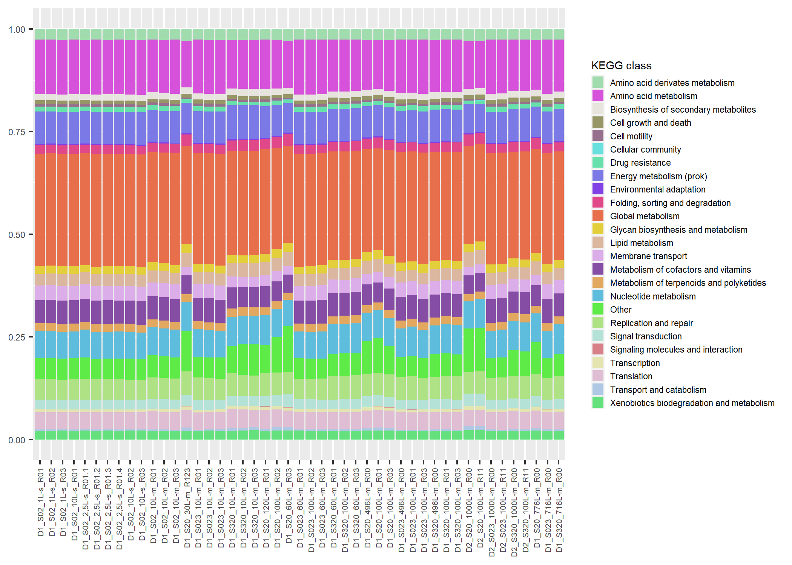
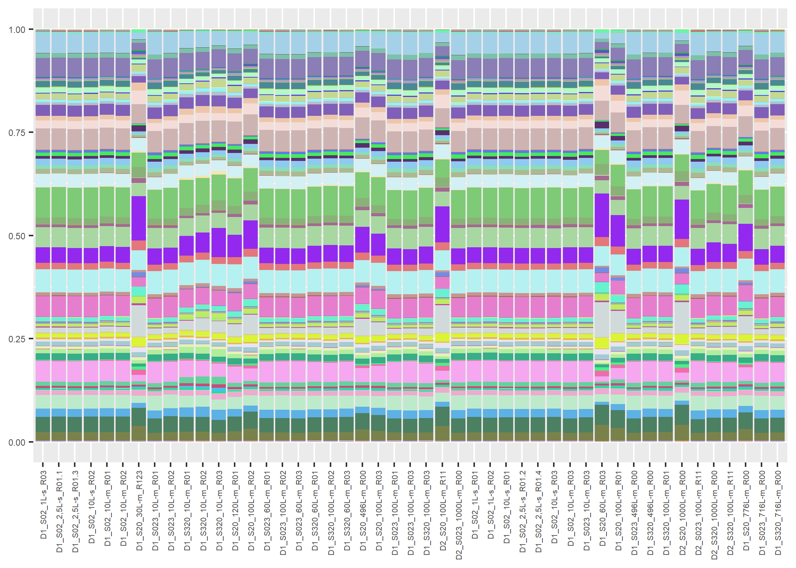
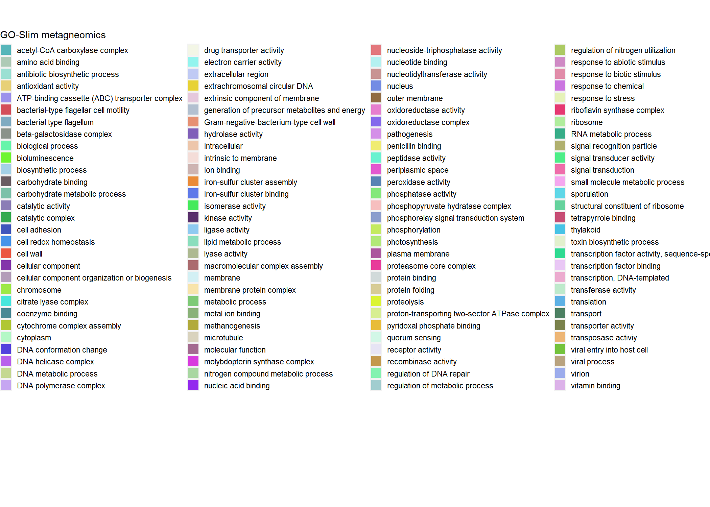

Function representation
================
Sergio Gozalo
29 de enero de 2021

## Loading necessary libraries

``` r
library("vegan")
```

    ## Loading required package: permute

    ## Loading required package: lattice

    ## This is vegan 2.5-7

``` r
library("ggplot2")
library("tidyr")
library("dplyr")
```

    ## 
    ## Attaching package: 'dplyr'

    ## The following objects are masked from 'package:stats':
    ## 
    ##     filter, lag

    ## The following objects are masked from 'package:base':
    ## 
    ##     intersect, setdiff, setequal, union

``` r
library("reshape2")
```

    ## 
    ## Attaching package: 'reshape2'

    ## The following object is masked from 'package:tidyr':
    ## 
    ##     smiths

``` r
library("randomcoloR")
```

# Function representation

``` r
f_go_abundances <- read.table("functional.tables/ERP112966_GO_abundances_v4.1.tsv", header = TRUE, row.names = 1, sep ="\t")

f_go.slim_abundances <- read.table("functional.tables/ERP112966_GO-slim_abundances_v4.1.tsv", header = TRUE, row.names = 1, sep ="\t")

f_kegg_meta <- (read.table("functional.tables/EMOSE-GC_ICM_250bp_KEGG.ko.lengthNorm.metaGsizeNorm.counts.tbl", header = TRUE, sep = "\t", row.names = 1))
f_kegg_scg <- (read.table("functional.tables/EMOSE-GC_ICM_250bp_KEGG.ko.lengthNorm.SCGnorm.counts.tbl", header = TRUE, sep = "\t", row.names = 1))

ekey <- read.table("functional.tables/ekey.txt")
slim <- read.table("functional.tables/GO.slim.txt")
```

``` r
#KO and path conexion
ko_to_path <- read.table(text = gsub(":", "\t", readLines("functional.tables/ko_pathway.list")))
ko_to_path <- ko_to_path %>%
  select(2, 4)
colnames(ko_to_path)[1] <- "KO"
colnames(ko_to_path)[2] <- "Path"

#Path id to path name
path_name <- read.delim("functional.tables/pathway_name.list", header = FALSE)
path_name <- path_name %>%
  separate(V1, c(NA, "Path"), ":")
colnames(path_name)[2] <- "PName"

#Merge to obtain KO id and path name together
all_data_kegg <- merge(ko_to_path, path_name)

#Path name with path class
hierarchy <- read.delim("functional.tables/kegg_hierarchy.txt", header = TRUE)
hierarchy <- hierarchy %>%
  select(3,4)

#Merge
all_data_kegg <- merge(all_data_kegg, hierarchy)

#Computing the row sums for every KO in the samples table
f_kegg_meta2 <- f_kegg_meta
f_kegg_meta2$sum <- rowSums(f_kegg_meta)
f_kegg_meta2 <- f_kegg_meta2 %>%
  select(0, 51)
f_kegg_meta2 <- tibble::rownames_to_column(f_kegg_meta2, "KO")

#
f_kegg_meta <- tibble::rownames_to_column(f_kegg_meta, "KO")

#Merge all
all_data_kegg1 <- merge(all_data_kegg, f_kegg_meta2, by = "KO")
all_data_kegg2 <- merge(all_data_kegg, f_kegg_meta, by = "KO")

#Transform to wide
all_data_kegg1 <- spread(all_data_kegg1, key = PClass, value = sum)

# Overall Selecting columns
class_sums <- all_data_kegg1 %>%
  select(-1,-2,-3)
kegg_prop <- data.frame(t(colSums(class_sums, na.rm = TRUE)))

# By sample
kegg_by_sample <- all_data_kegg2 %>%
  select(-1,-2,-3)
kegg_by_sample <- kegg_by_sample %>%
  group_by(PClass) %>%
  summarise(across(starts_with("ERR"),sum))
```

    ## `summarise()` ungrouping output (override with `.groups` argument)

``` r
lista <- "PClass"
lista <- c(lista, ekey$V3)
colnames(kegg_by_sample) <- lista
```

``` r
kegg_by_sample <- melt(kegg_by_sample, id.vars = "PClass")

# Plots
pale <- distinctColorPalette(30)
ggplot(kegg_by_sample, aes(x=variable, y = value, fill = PClass)) + geom_bar(position = "fill", stat = "identity") + theme(text = element_text(size = 7), axis.text.x = element_text(size = 5, angle = 90, vjust = 0.5, hjust=1), legend.key.size = unit(0.3, "cm")) + labs(x = NULL, y = NULL, fill = "KEGG class") + guides(fill=guide_legend(ncol=1)) + scale_fill_manual(values = pale)
```



``` r
f_go.slim_abundances <- tibble::rownames_to_column(f_go.slim_abundances, "GO")
f_go.slim_abundances[1] <- NULL
f_go.slim_abundances[2] <- NULL
l <- "description"
l<- c(l,slim$V3)
colnames(f_go.slim_abundances) <- l
f_go.slim_abundances <- melt(f_go.slim_abundances, id.vars = "description")
```

``` r
pale <- distinctColorPalette(116)
GO_Slim_plot <- ggplot(f_go.slim_abundances, aes(x=variable, y = value, fill = description)) + geom_bar(position = "fill", stat = "identity") + theme(text = element_text(size = 7), axis.text.x = element_text(size = 5, angle = 90, vjust = 0.5, hjust=1), legend.position = "none")  + scale_fill_manual(values = pale) + labs(x = NULL, y = NULL)

GO_Slim_legend <- ggplot(f_go.slim_abundances, aes(x=variable, y = value, fill = description)) + geom_bar(position = "fill", stat = "identity") + theme(text = element_text(size = 7), axis.text.x = element_text(size = 5, angle = 90, vjust = 0.5, hjust=1), legend.key.size = unit(0.3, "cm"), plot.margin = unit(c(1,1,1,1.6), "cm")) + labs(x = NULL, y = NULL, fill = "GO-Slim metagneomics") + guides(fill=guide_legend(ncol=4)) + scale_fill_manual(values = pale)

GO_Slim_plot
```



``` r
GO_Slim_legend
```


