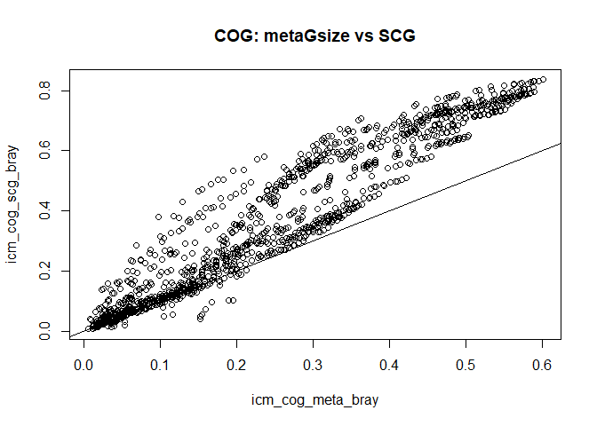
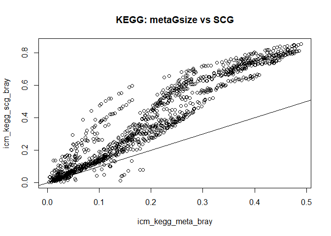
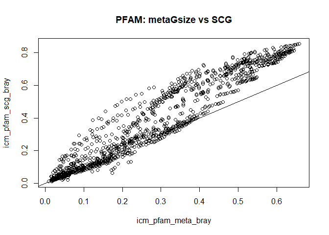
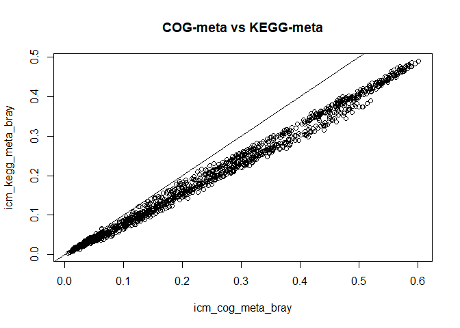
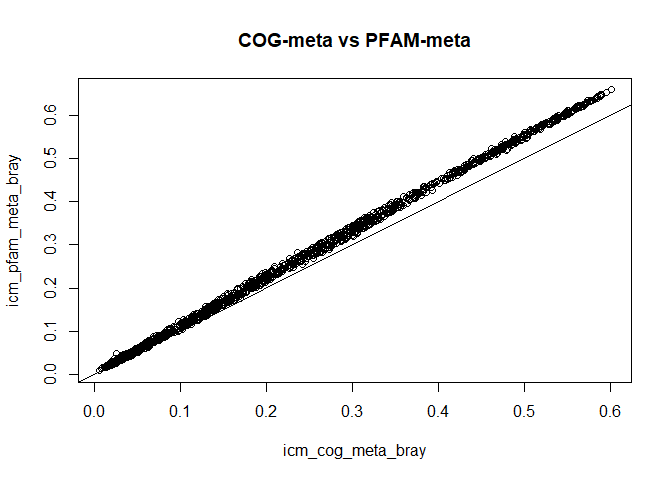
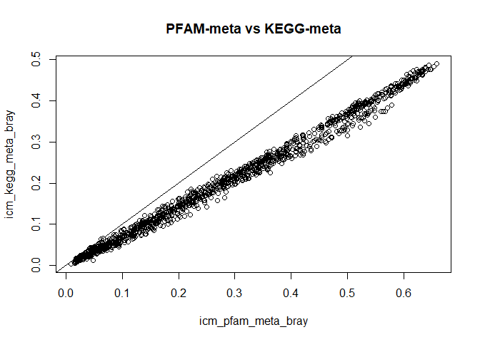
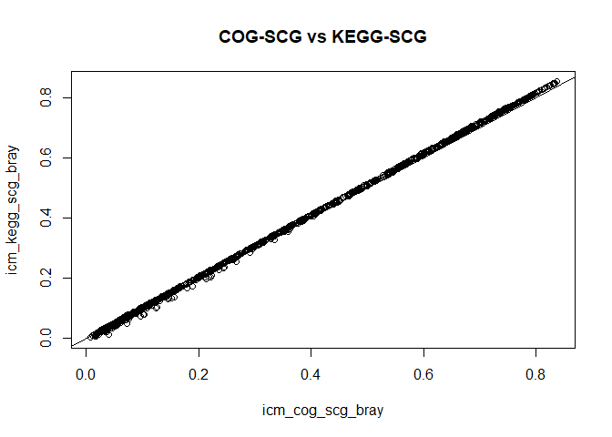
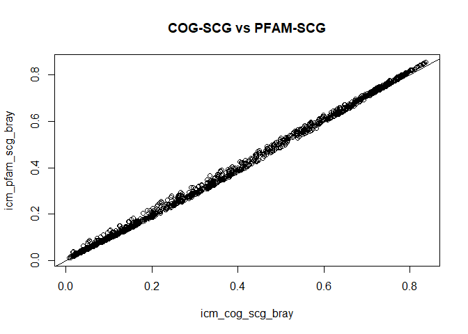
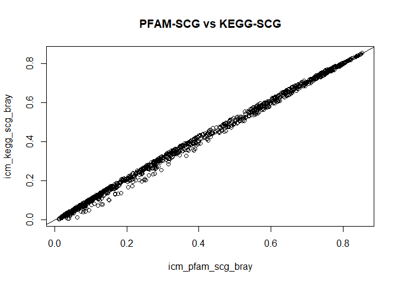

ICM Pipeline Comparisson
================
Sergio Gozalo
25 de febrero de 2021

## Loading necessary libraries

``` r
library("vegan")
```

    ## Loading required package: permute

    ## Loading required package: lattice

    ## This is vegan 2.5-7

``` r
library("ggplot2")
library("tidyr")
library("dplyr")
```

    ## 
    ## Attaching package: 'dplyr'

    ## The following objects are masked from 'package:stats':
    ## 
    ##     filter, lag

    ## The following objects are masked from 'package:base':
    ## 
    ##     intersect, setdiff, setequal, union

## Table reading

``` r
icm_cog_meta <- t(read.table("functional.tables/EMOSE-GC_ICM_250bp_COG.lengthNorm.metaGsizeNorm.counts.tbl", header = TRUE, sep = "\t", row.names = 1))
icm_cog_scg <- t(read.table("functional.tables/EMOSE-GC_ICM_250bp_COG.lengthNorm.SCGnorm.counts.tbl", header = TRUE, sep = "\t", row.names = 1))

icm_kegg_meta <- t(read.table("functional.tables/EMOSE-GC_ICM_250bp_KEGG.ko.lengthNorm.metaGsizeNorm.counts.tbl", header = TRUE, sep = "\t", row.names = 1))
icm_kegg_scg <- t(read.table("functional.tables/EMOSE-GC_ICM_250bp_KEGG.ko.lengthNorm.SCGnorm.counts.tbl", header = TRUE, sep = "\t", row.names = 1))

icm_pfam_meta <- t(read.table("functional.tables/EMOSE-GC_ICM_250bp_pfam.lengthNorm.metaGsizeNorm.counts.tbl", header = TRUE, sep = "\t", row.names = 1))
icm_pfam_scg <- t(read.table("functional.tables/EMOSE-GC_ICM_250bp_pfam.lengthNorm.SCGnorm.counts.tbl", header = TRUE, sep = "\t", row.names = 1))
```

## Bray-Curtis dissmilarity matrix

``` r
#COG
icm_cog_meta_bray <- vegdist(icm_cog_meta, method="bray")
icm_cog_scg_bray <- vegdist(icm_cog_scg, method="bray")

#KEGG
icm_kegg_meta_bray <-vegdist(icm_kegg_meta, method="bray") 
icm_kegg_scg_bray <-vegdist(icm_kegg_scg, method="bray") 

#PFAM
icm_pfam_meta_bray <-vegdist(icm_pfam_meta, method="bray") 
icm_pfam_scg_bray <-vegdist(icm_pfam_scg, method="bray")
```

# MetaGSize vs SCG

## Comparing MetaGSize and SCG normalizations

``` r
#Plots
plot(icm_cog_meta_bray, icm_cog_scg_bray, main = "COG: metaGsize vs SCG")
abline(0,1)
```



``` r
plot(icm_kegg_meta_bray, icm_kegg_scg_bray, main = "KEGG: metaGsize vs SCG")
abline(0,1)
```



``` r
plot(icm_pfam_meta_bray, icm_pfam_scg_bray, main = "PFAM: metaGsize vs SCG")
abline(0,1)
```



``` r
#Mantel test for correlation
mantel(icm_cog_meta_bray, icm_cog_scg_bray)
```

    ## 
    ## Mantel statistic based on Pearson's product-moment correlation 
    ## 
    ## Call:
    ## mantel(xdis = icm_cog_meta_bray, ydis = icm_cog_scg_bray) 
    ## 
    ## Mantel statistic r: 0.956 
    ##       Significance: 0.001 
    ## 
    ## Upper quantiles of permutations (null model):
    ##    90%    95%  97.5%    99% 
    ## 0.0464 0.0683 0.0932 0.1274 
    ## Permutation: free
    ## Number of permutations: 999

``` r
mantel(icm_kegg_meta_bray, icm_kegg_scg_bray)
```

    ## 
    ## Mantel statistic based on Pearson's product-moment correlation 
    ## 
    ## Call:
    ## mantel(xdis = icm_kegg_meta_bray, ydis = icm_kegg_scg_bray) 
    ## 
    ## Mantel statistic r: 0.957 
    ##       Significance: 0.001 
    ## 
    ## Upper quantiles of permutations (null model):
    ##    90%    95%  97.5%    99% 
    ## 0.0460 0.0698 0.0930 0.1174 
    ## Permutation: free
    ## Number of permutations: 999

``` r
mantel(icm_pfam_meta_bray, icm_pfam_scg_bray)
```

    ## 
    ## Mantel statistic based on Pearson's product-moment correlation 
    ## 
    ## Call:
    ## mantel(xdis = icm_pfam_meta_bray, ydis = icm_pfam_scg_bray) 
    ## 
    ## Mantel statistic r: 0.9565 
    ##       Significance: 0.001 
    ## 
    ## Upper quantiles of permutations (null model):
    ##    90%    95%  97.5%    99% 
    ## 0.0481 0.0662 0.0855 0.1157 
    ## Permutation: free
    ## Number of permutations: 999

Both, plots and mantel tests, show a very high positive correlation.

## Comparisson of MetaGSize from different tables

``` r
#Plots
plot(icm_cog_meta_bray, icm_kegg_meta_bray, main = "COG-meta vs KEGG-meta")
abline(0,1)
```



``` r
plot(icm_cog_meta_bray, icm_pfam_meta_bray, main = "COG-meta vs PFAM-meta")
abline(0,1)
```



``` r
plot(icm_pfam_meta_bray, icm_kegg_meta_bray, main = "PFAM-meta vs KEGG-meta")
abline(0,1)
```



``` r
#Mantel test for correlation
mantel(icm_cog_meta_bray, icm_kegg_meta_bray)
```

    ## 
    ## Mantel statistic based on Pearson's product-moment correlation 
    ## 
    ## Call:
    ## mantel(xdis = icm_cog_meta_bray, ydis = icm_kegg_meta_bray) 
    ## 
    ## Mantel statistic r: 0.9965 
    ##       Significance: 0.001 
    ## 
    ## Upper quantiles of permutations (null model):
    ##    90%    95%  97.5%    99% 
    ## 0.0447 0.0631 0.0785 0.1009 
    ## Permutation: free
    ## Number of permutations: 999

``` r
mantel(icm_cog_meta_bray, icm_pfam_meta_bray)
```

    ## 
    ## Mantel statistic based on Pearson's product-moment correlation 
    ## 
    ## Call:
    ## mantel(xdis = icm_cog_meta_bray, ydis = icm_pfam_meta_bray) 
    ## 
    ## Mantel statistic r: 0.9995 
    ##       Significance: 0.001 
    ## 
    ## Upper quantiles of permutations (null model):
    ##    90%    95%  97.5%    99% 
    ## 0.0376 0.0548 0.0724 0.1031 
    ## Permutation: free
    ## Number of permutations: 999

``` r
mantel(icm_pfam_meta_bray, icm_kegg_meta_bray)
```

    ## 
    ## Mantel statistic based on Pearson's product-moment correlation 
    ## 
    ## Call:
    ## mantel(xdis = icm_pfam_meta_bray, ydis = icm_kegg_meta_bray) 
    ## 
    ## Mantel statistic r: 0.9962 
    ##       Significance: 0.001 
    ## 
    ## Upper quantiles of permutations (null model):
    ##    90%    95%  97.5%    99% 
    ## 0.0518 0.0750 0.0954 0.1218 
    ## Permutation: free
    ## Number of permutations: 999

Again, plots and mantel tests shows high correlation, that implies that results are consistent since different databases provide very similar results

## Comparisson of SCG from different tables

``` r
#Plots
plot(icm_cog_scg_bray, icm_kegg_scg_bray, main = "COG-SCG vs KEGG-SCG")
abline(0,1)
```



``` r
plot(icm_cog_scg_bray, icm_pfam_scg_bray, main = "COG-SCG vs PFAM-SCG")
abline(0,1)
```



``` r
plot(icm_pfam_scg_bray, icm_kegg_scg_bray, main = "PFAM-SCG vs KEGG-SCG")
abline(0,1)
```



``` r
#Mantel test for correlation
mantel(icm_cog_scg_bray, icm_pfam_scg_bray)
```

    ## 
    ## Mantel statistic based on Pearson's product-moment correlation 
    ## 
    ## Call:
    ## mantel(xdis = icm_cog_scg_bray, ydis = icm_pfam_scg_bray) 
    ## 
    ## Mantel statistic r: 0.9992 
    ##       Significance: 0.001 
    ## 
    ## Upper quantiles of permutations (null model):
    ##    90%    95%  97.5%    99% 
    ## 0.0617 0.0885 0.1209 0.1424 
    ## Permutation: free
    ## Number of permutations: 999

``` r
mantel(icm_cog_scg_bray, icm_kegg_scg_bray)
```

    ## 
    ## Mantel statistic based on Pearson's product-moment correlation 
    ## 
    ## Call:
    ## mantel(xdis = icm_cog_scg_bray, ydis = icm_kegg_scg_bray) 
    ## 
    ## Mantel statistic r: 0.9999 
    ##       Significance: 0.001 
    ## 
    ## Upper quantiles of permutations (null model):
    ##    90%    95%  97.5%    99% 
    ## 0.0566 0.0777 0.1127 0.1309 
    ## Permutation: free
    ## Number of permutations: 999

``` r
mantel(icm_pfam_scg_bray, icm_kegg_scg_bray)
```

    ## 
    ## Mantel statistic based on Pearson's product-moment correlation 
    ## 
    ## Call:
    ## mantel(xdis = icm_pfam_scg_bray, ydis = icm_kegg_scg_bray) 
    ## 
    ## Mantel statistic r: 0.9987 
    ##       Significance: 0.001 
    ## 
    ## Upper quantiles of permutations (null model):
    ##    90%    95%  97.5%    99% 
    ## 0.0529 0.0750 0.1028 0.1347 
    ## Permutation: free
    ## Number of permutations: 999

Once more, results show very high correlation, in this case is even greater than in the metaGSize.

## Conclusion

The results of all databases from the ICM pipeline are very similar and consistent.
