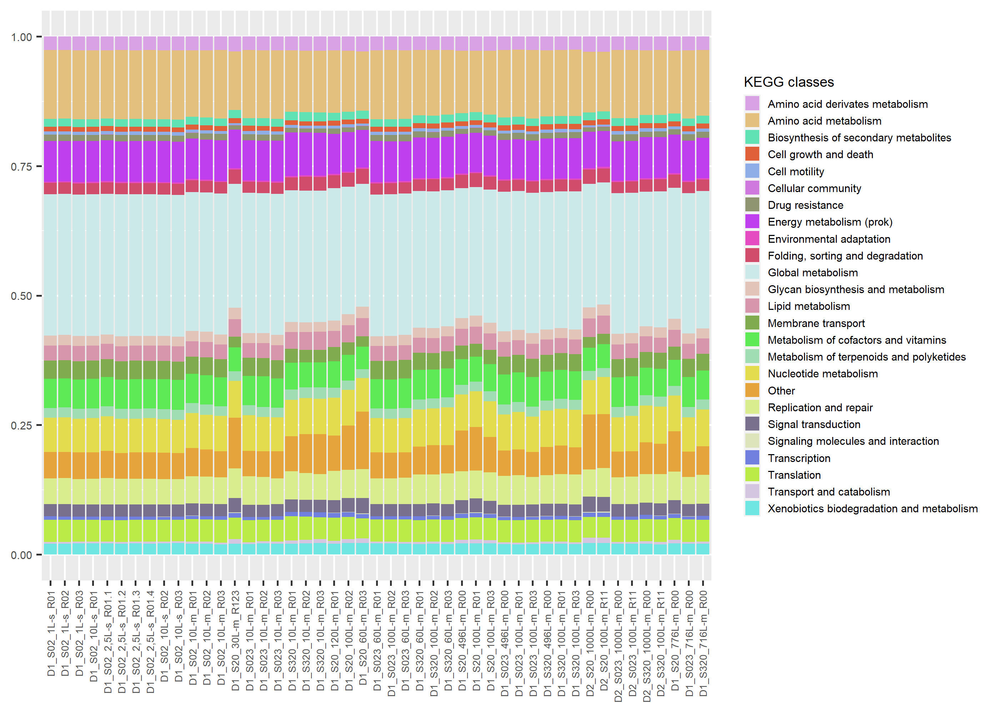
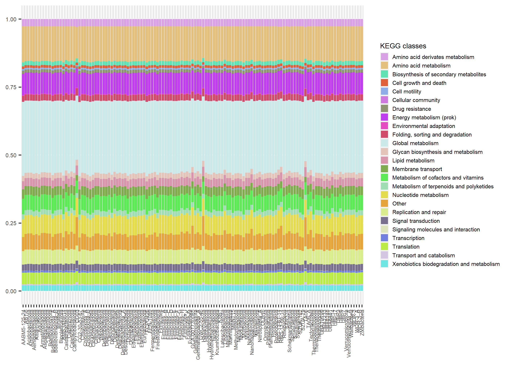
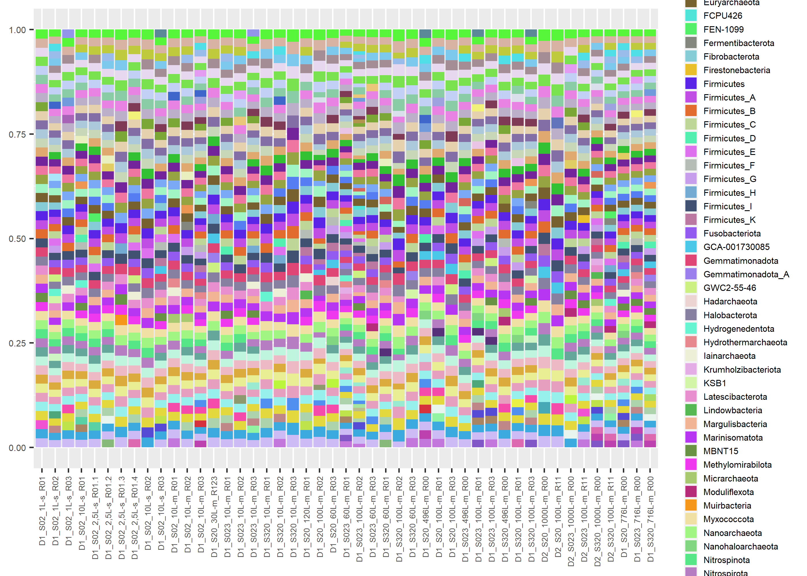
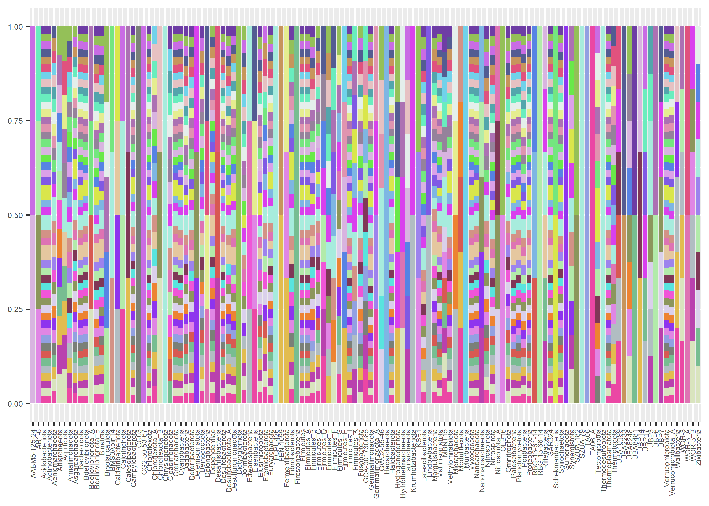
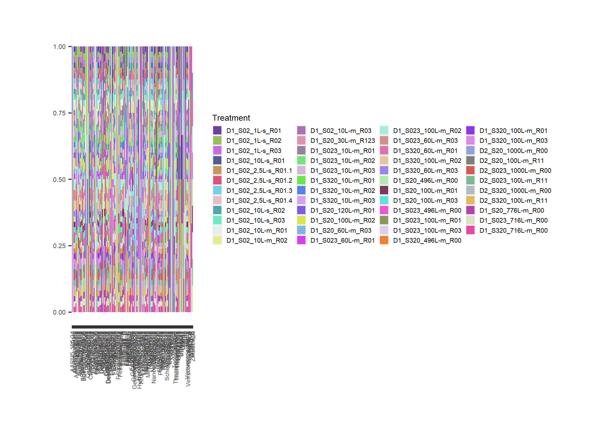
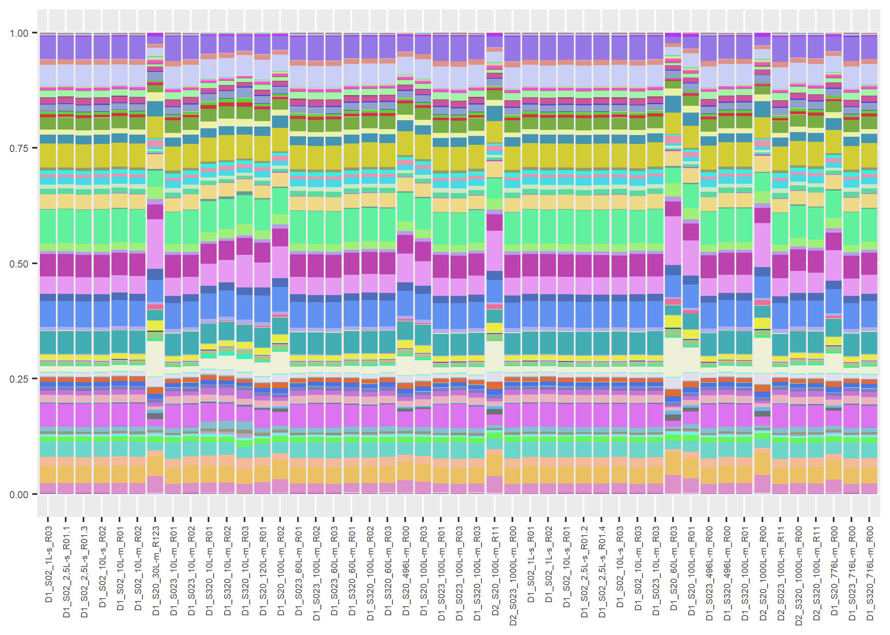
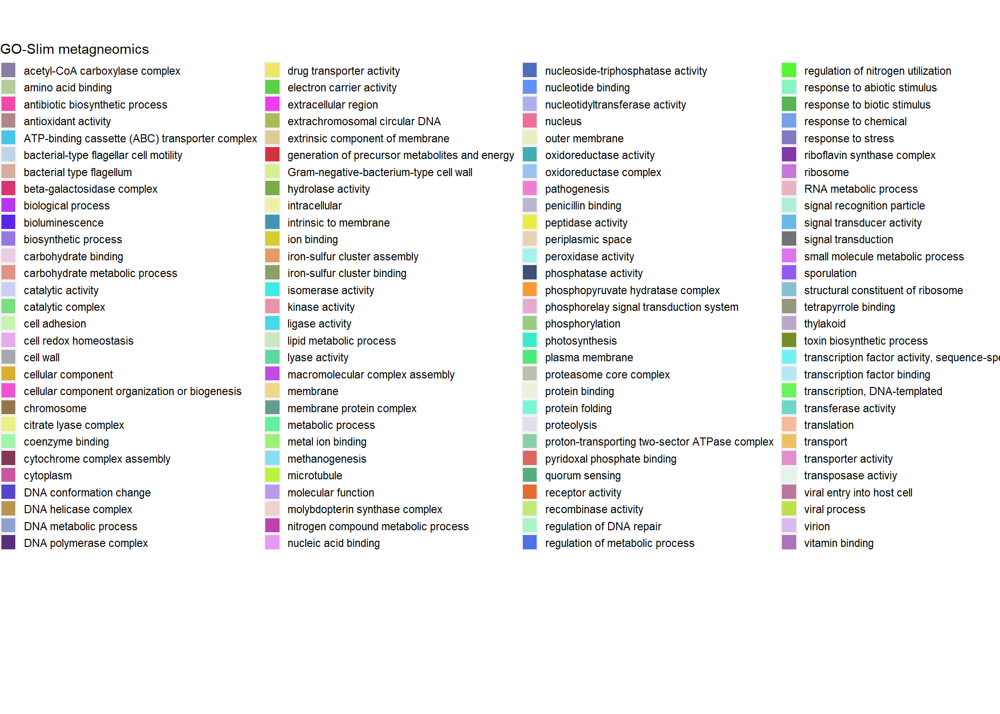

Taxonomic classification
================
Sergio Gozalo
2 de marzo de 2021

## Loading necessary libraries

``` r
library("vegan")
library("ggplot2")
library("tidyr")
library("plyr")
library("dplyr")
library("reshape2")
library("randomcoloR")
```

# Taxonomic classification

## Tables reading

``` r
#EBI
f_go.slim_abundances <- read.table("functional.tables/ERP112966_GO-slim_abundances_v4.1.tsv", header = TRUE, row.names = 1, sep ="\t")

#ICM
f_kegg_scg <- (read.table("functional.tables/EMOSE-GC_ICM_250bp_KEGG.ko.lengthNorm.SCGnorm.counts.tbl", header = TRUE, sep = "\t", row.names = 1))

icm_cog_scg <- (read.table("functional.tables/EMOSE-GC_ICM_250bp_COG.lengthNorm.SCGnorm.counts.tbl", header = TRUE, sep = "\t", row.names = 1))

icm_pfam_scg <- (read.table("functional.tables/EMOSE-GC_ICM_250bp_pfam.lengthNorm.SCGnorm.counts.tbl", header = TRUE, sep = "\t", row.names = 1))

ekey <- read.table("functional.tables/ekey.txt")
slim <- read.table("functional.tables/GO.slim.txt")
```

## KEGG

``` r
#KO and path conexion
ko_to_path <- read.table(text = gsub(":", "\t", readLines("functional.tables/ko_pathway.list")))
ko_to_path <- ko_to_path %>%
  select(2, 4)
colnames(ko_to_path)[1] <- "KO"
colnames(ko_to_path)[2] <- "Path"

#Path id to path name
path_name <- read.delim("functional.tables/pathway_name.list", header = FALSE)
path_name <- path_name %>%
  separate(V1, c(NA, "Path"), ":")
colnames(path_name)[2] <- "PName"

#Merge to obtain KO id and path name together
all_data_kegg <- merge(ko_to_path, path_name)

#Path name with path class
hierarchy <- read.delim("functional.tables/kegg_hierarchy.txt", header = TRUE)
hierarchy <- hierarchy %>%
  select(3,4)

#Merge
all_data_kegg <- merge(all_data_kegg, hierarchy)

#Computing the row sums for every KO in the samples table
f_kegg_scg2 <- f_kegg_scg
f_kegg_scg2$sum <- rowSums(f_kegg_scg)
f_kegg_scg2 <- f_kegg_scg2 %>%
  select(0, 51)
f_kegg_scg <- tibble::rownames_to_column(f_kegg_scg, "KO")

#Merge all
all_data_kegg1 <- merge(all_data_kegg, f_kegg_scg, by = "KO")


# By sample
kegg_by_sample <- all_data_kegg1 %>%
  select(-1,-2,-3)
#(actualizacion y no funciona?, igualmente el codigo funciona, esto solo hacia mas bonito) ***arrreglado, problema librerias
kegg_by_sample <- kegg_by_sample %>%
  group_by(PClass) %>%
  dplyr::summarise(across(starts_with("ERR"),sum))

lista <- "PClass"
lista <- c(lista, ekey$V3)
colnames(kegg_by_sample) <- lista

kegg_by_sample <- melt(kegg_by_sample, id.vars = "PClass")
```

# Function by treatment

``` r
taxonomy <- read.table("functional.tables/taxonomyResult.samplev.tsv.txt", sep = "\t")
#taxonomy <- taxonomy %>% separate(V5, c("Class2","Class3","Class4","Class5","Class6","Class7", "Class8"), ";")
taxonomy_no_nulls <- subset(taxonomy, V3  == c("species", "genus","class","family"))
taxonomy_no_nulls_ <- taxonomy_no_nulls %>%
  separate(V1, c("Sample", NA), ".k")


#By class (hay muchisimas)
#taxonomy_order <- taxonomy_no_nulls_ %>%
#  select(1,9)
#taxonomy_order <- unique(taxonomy_order[c("Sample", "V9")])
#taxonomy_by <- split(taxonomy_order, taxonomy_order$V9)

#By phylum
taxonomy_order_p <- taxonomy_no_nulls_ %>%
  select(1,10)
taxonomy_order_p <- unique(taxonomy_order_p[c("Sample", "V10")])
taxonomy_by_p <- split(taxonomy_order_p, taxonomy_order_p$V10)


# cambiando el nombre de la sample al metodo de filtrado
prueba <- taxonomy_order_p
vector <- prueba$Sample
vector <- mapvalues(vector, from= ekey$V2, to= ekey$V3)
prueba$Sample <- vector
colnames(kegg_by_sample) <- c("PClass", "Sample", "value")
# kegg_treatment <- split(kegg_by_sample, kegg_by_sample$variable) *** no hace falta?


# Merging the kegg matrix with the taxa matrix
taxa_kegg <- merge(kegg_by_sample, prueba, by = "Sample")
```

# Kegg plots

## KEGG by treatment

``` r
pale <- distinctColorPalette(30)
ggplot(taxa_kegg, aes(x=Sample, y = value, fill = PClass)) + geom_bar(position = "fill", stat = "identity") + theme(text = element_text(size = 7), axis.text.x = element_text(size = 5, angle = 90, vjust = 0.5, hjust=1), legend.key.size = unit(0.3, "cm")) + labs(x = NULL, y = NULL, fill = "KEGG classes") + guides(fill=guide_legend(ncol=1)) + scale_fill_manual(values = pale)
```



## KEGG by taxa

``` r
ggplot(taxa_kegg, aes(x=V10, y = value, fill = PClass)) + geom_bar(position = "fill", stat = "identity") + theme(text = element_text(size = 7), axis.text.x = element_text(size = 5, angle = 90, vjust = 0.5, hjust=1), legend.key.size = unit(0.3, "cm")) + labs(x = NULL, y = NULL, fill = "KEGG classes") + guides(fill=guide_legend(ncol=1)) + scale_fill_manual(values = pale)
```



## KEGG taxa by treatment

``` r
taxa_treatment_kegg <- taxa_kegg %>%
  select(1, 4)
taxa_treatment_kegg$counter <- 1


## Hay que elegir que plot queda mejor, si treatments en x y taxa en fill o al rev攼㸹s

pale2 <- distinctColorPalette(127)
ggplot(taxa_treatment_kegg, aes(x=Sample, y =counter, fill = V10)) + geom_bar(position = "fill", stat = "identity") + theme(text = element_text(size = 7), axis.text.x = element_text(size = 5, angle = 90, vjust = 0.5, hjust=1), legend.key.size = unit(0.3, "cm")) + labs(x = NULL, y = NULL, fill = "KEGG classes") + guides(fill=guide_legend(ncol=1)) + scale_fill_manual(values = pale2)
```



``` r
pale2 <- distinctColorPalette(47)
taxa_treatment_plot <- ggplot(taxa_treatment_kegg, aes(x=V10, y = counter, fill = Sample)) + geom_bar(position = "fill", stat = "identity") + theme(text = element_text(size = 7), axis.text.x = element_text(size = 5, angle = 90, vjust = 0.5, hjust=1), legend.position = "none")  + scale_fill_manual(values = pale2) + labs(x = NULL, y = NULL)

taxa_treatment_legend <- ggplot(taxa_treatment_kegg, aes(x=V10, y = counter, fill = Sample)) + geom_bar(position = "fill", stat = "identity") + theme(text = element_text(size = 7), axis.text.x = element_text(size = 5, angle = 90, vjust = 0.5, hjust=1), legend.key.size = unit(0.3, "cm"), plot.margin = unit(c(1,1,1,1.6), "cm")) + labs(x = NULL, y = NULL, fill = "Treatment") + guides(fill=guide_legend(ncol=4)) + scale_fill_manual(values = pale2)

taxa_treatment_plot
```



``` r
taxa_treatment_legend
```



## COG

``` r
cog_categories <- read.delim("functional.tables/COG_categories/letra-categorias.txt")
cog_to_cat <- read.delim("functional.tables/COG_categories/cog_result_table_all.tsv")
cog_to_cat <- cog_to_cat %>%
  select(-1,-2,-5)

cog_to_cat$category <- cog_categories$Categoria[charmatch(cog_to_cat$Cat, cog_categories$Letra)]

icm_cog_scg2 <- icm_cog_scg
icm_cog_scg2$sum <- rowSums(icm_cog_scg)
icm_cog_scg2 <- icm_cog_scg2 %>%
  select(0, 51)
icm_cog_scg <- tibble::rownames_to_column(icm_cog_scg, "COG")
```

## GO-SLIM

``` r
f_go.slim_abundances <- tibble::rownames_to_column(f_go.slim_abundances, "GO")
f_go.slim_abundances[1] <- NULL
f_go.slim_abundances[2] <- NULL
l <- "description"
l<- c(l,slim$V3)
colnames(f_go.slim_abundances) <- l
f_go.slim_abundances <- melt(f_go.slim_abundances, id.vars = "description")
```

``` r
pale <- distinctColorPalette(116)
GO_Slim_plot <- ggplot(f_go.slim_abundances, aes(x=variable, y = value, fill = description)) + geom_bar(position = "fill", stat = "identity") + theme(text = element_text(size = 7), axis.text.x = element_text(size = 5, angle = 90, vjust = 0.5, hjust=1), legend.position = "none")  + scale_fill_manual(values = pale) + labs(x = NULL, y = NULL)

GO_Slim_legend <- ggplot(f_go.slim_abundances, aes(x=variable, y = value, fill = description)) + geom_bar(position = "fill", stat = "identity") + theme(text = element_text(size = 7), axis.text.x = element_text(size = 5, angle = 90, vjust = 0.5, hjust=1), legend.key.size = unit(0.3, "cm"), plot.margin = unit(c(1,1,1,1.6), "cm")) + labs(x = NULL, y = NULL, fill = "GO-Slim metagneomics") + guides(fill=guide_legend(ncol=4)) + scale_fill_manual(values = pale)

GO_Slim_plot
```



``` r
GO_Slim_legend
```


