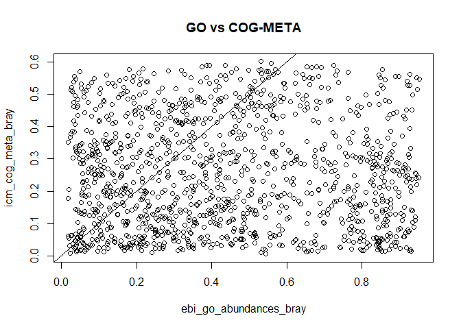
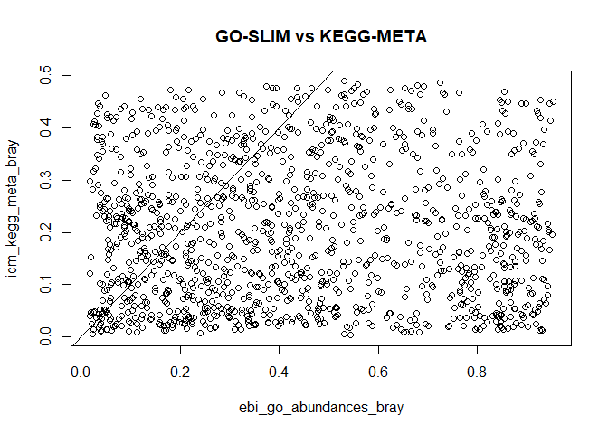
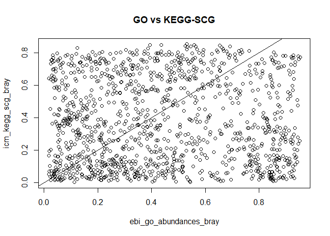
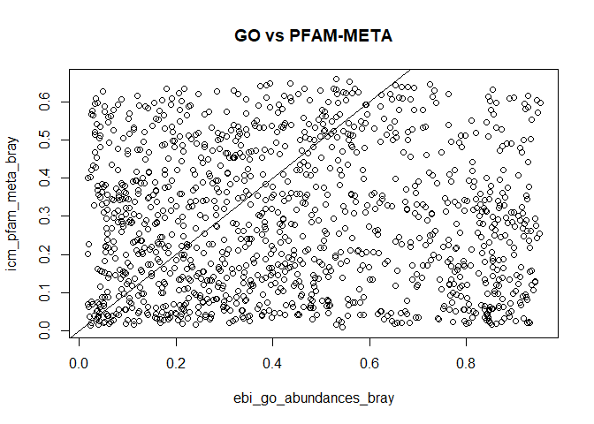
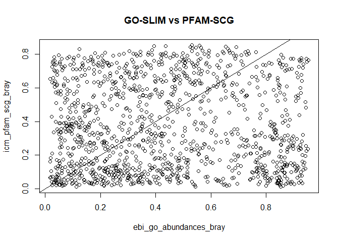

ICM\_vs\_EBI\_Pipeline\_Comparisson
================
Sergio Gozalo
26 de febrero de 2021

## Loading necessary libraries

``` r
library("vegan")
```

    ## Loading required package: permute

    ## Loading required package: lattice

    ## This is vegan 2.5-7

``` r
library("ggplot2")
library("tidyr")
library("dplyr")
```

    ## 
    ## Attaching package: 'dplyr'

    ## The following objects are masked from 'package:stats':
    ## 
    ##     filter, lag

    ## The following objects are masked from 'package:base':
    ## 
    ##     intersect, setdiff, setequal, union

## Table reading

``` r
# EBI
ebi_to_icm <- read.table("functional.tables/ebi_to_icm.txt")
lista <- ebi_to_icm$V3
ebi_go_abundances <- read.table("functional.tables/ERP112966_GO_abundances_v4.1.tsv", header = TRUE, row.names = 1, sep ="\t")
ebi_go_abundances$description <- NULL #Need to remove this column to work
ebi_go_abundances$category <- NULL #Need to remove this column to work
colnames(ebi_go_abundances) <- lista
ebi_go_abundances <- t(ebi_go_abundances)

ebi_go.slim_abundances <- read.table("functional.tables/ERP112966_GO-slim_abundances_v4.1.tsv", header = TRUE, row.names = 1, sep ="\t")
ebi_go.slim_abundances$description <- NULL
ebi_go.slim_abundances$category <- NULL
colnames(ebi_go.slim_abundances) <- lista
ebi_go.slim_abundances <- t(ebi_go.slim_abundances)

ebi_ipr_abundances <- read.table("functional.tables/ERP112966_IPR_abundances_v4.1.tsv", header = TRUE, row.names = 1, sep ="\t")
ebi_ipr_abundances$description <- NULL
ebi_ipr_abundances$category <- NULL
colnames(ebi_ipr_abundances) <- lista
ebi_ipr_abundances <- t(ebi_ipr_abundances)

#ICM
icm_cog_meta <- t(read.table("functional.tables/EMOSE-GC_ICM_250bp_COG.lengthNorm.metaGsizeNorm.counts.tbl", header = TRUE, sep = "\t", row.names = 1))
icm_cog_scg <- t(read.table("functional.tables/EMOSE-GC_ICM_250bp_COG.lengthNorm.SCGnorm.counts.tbl", header = TRUE, sep = "\t", row.names = 1))

icm_kegg_meta <- t(read.table("functional.tables/EMOSE-GC_ICM_250bp_KEGG.ko.lengthNorm.metaGsizeNorm.counts.tbl", header = TRUE, sep = "\t", row.names = 1))
icm_kegg_scg <- t(read.table("functional.tables/EMOSE-GC_ICM_250bp_KEGG.ko.lengthNorm.SCGnorm.counts.tbl", header = TRUE, sep = "\t", row.names = 1))

icm_pfam_meta <- t(read.table("functional.tables/EMOSE-GC_ICM_250bp_pfam.lengthNorm.metaGsizeNorm.counts.tbl", header = TRUE, sep = "\t", row.names = 1))
icm_pfam_scg <- t(read.table("functional.tables/EMOSE-GC_ICM_250bp_pfam.lengthNorm.SCGnorm.counts.tbl", header = TRUE, sep = "\t", row.names = 1))
```

## Bray-Curtis dissmilarity matrix

``` r
# EBI
ebi_go_abundances_bray <- vegdist(ebi_go_abundances, method="bray")

ebi_go.slim_abundances_bray <- vegdist(ebi_go.slim_abundances, method="bray")

ebi_ipr_abundances_bray <- vegdist(ebi_ipr_abundances, method="bray")

#ICM
icm_cog_meta_bray <- vegdist(icm_cog_meta, method="bray")
icm_cog_scg_bray <- vegdist(icm_cog_scg, method="bray")

icm_kegg_meta_bray <-vegdist(icm_kegg_meta, method="bray") 
icm_kegg_scg_bray <-vegdist(icm_kegg_scg, method="bray") 

icm_pfam_meta_bray <-vegdist(icm_pfam_meta, method="bray") 
icm_pfam_scg_bray <-vegdist(icm_pfam_scg, method="bray")
```

## Comparisson ICM vs EBI

### GO vs EBI

``` r
# Plots
plot(ebi_go_abundances_bray, icm_cog_meta_bray, main = "GO vs COG-META")
abline(0,1)
```



``` r
plot(ebi_go_abundances_bray, icm_cog_scg_bray, main = "GO vs COG-SCG")
abline(0,1)
```


``` r
plot(ebi_go_abundances_bray, icm_kegg_meta_bray, main = "GO-SLIM vs KEGG-META")
abline(0,1)
```



``` r
plot(ebi_go_abundances_bray, icm_kegg_scg_bray, main = "GO vs KEGG-SCG")
abline(0,1)
```



``` r
plot(ebi_go_abundances_bray, icm_pfam_meta_bray, main = "GO vs PFAM-META")
abline(0,1)
```



``` r
plot(ebi_go_abundances_bray, icm_pfam_scg_bray, main = "GO-SLIM vs PFAM-SCG")
abline(0,1)
```



``` r
#Mantel test for correlation
mantel(ebi_go_abundances_bray, icm_cog_meta_bray)
```

    ## 
    ## Mantel statistic based on Pearson's product-moment correlation 
    ## 
    ## Call:
    ## mantel(xdis = ebi_go_abundances_bray, ydis = icm_cog_meta_bray) 
    ## 
    ## Mantel statistic r: 0.00138 
    ##       Significance: 0.457 
    ## 
    ## Upper quantiles of permutations (null model):
    ##    90%    95%  97.5%    99% 
    ## 0.0656 0.0832 0.0969 0.1163 
    ## Permutation: free
    ## Number of permutations: 999

``` r
mantel(ebi_go_abundances_bray, icm_cog_scg_bray)
```

    ## 
    ## Mantel statistic based on Pearson's product-moment correlation 
    ## 
    ## Call:
    ## mantel(xdis = ebi_go_abundances_bray, ydis = icm_cog_scg_bray) 
    ## 
    ## Mantel statistic r: 0.0008085 
    ##       Significance: 0.443 
    ## 
    ## Upper quantiles of permutations (null model):
    ##    90%    95%  97.5%    99% 
    ## 0.0729 0.0983 0.1231 0.1492 
    ## Permutation: free
    ## Number of permutations: 999

``` r
mantel(ebi_go_abundances_bray, icm_kegg_meta_bray)
```

    ## 
    ## Mantel statistic based on Pearson's product-moment correlation 
    ## 
    ## Call:
    ## mantel(xdis = ebi_go_abundances_bray, ydis = icm_kegg_meta_bray) 
    ## 
    ## Mantel statistic r: 0.005213 
    ##       Significance: 0.416 
    ## 
    ## Upper quantiles of permutations (null model):
    ##    90%    95%  97.5%    99% 
    ## 0.0655 0.0898 0.1197 0.1460 
    ## Permutation: free
    ## Number of permutations: 999

``` r
mantel(ebi_go_abundances_bray, icm_kegg_scg_bray)
```

    ## 
    ## Mantel statistic based on Pearson's product-moment correlation 
    ## 
    ## Call:
    ## mantel(xdis = ebi_go_abundances_bray, ydis = icm_kegg_scg_bray) 
    ## 
    ## Mantel statistic r: 0.001333 
    ##       Significance: 0.397 
    ## 
    ## Upper quantiles of permutations (null model):
    ##    90%    95%  97.5%    99% 
    ## 0.0679 0.0968 0.1176 0.1522 
    ## Permutation: free
    ## Number of permutations: 999

``` r
mantel(ebi_go_abundances_bray, icm_pfam_meta_bray)
```

    ## 
    ## Mantel statistic based on Pearson's product-moment correlation 
    ## 
    ## Call:
    ## mantel(xdis = ebi_go_abundances_bray, ydis = icm_pfam_meta_bray) 
    ## 
    ## Mantel statistic r: -0.001198 
    ##       Significance: 0.458 
    ## 
    ## Upper quantiles of permutations (null model):
    ##    90%    95%  97.5%    99% 
    ## 0.0592 0.0823 0.1014 0.1386 
    ## Permutation: free
    ## Number of permutations: 999

``` r
mantel(ebi_go_abundances_bray, icm_pfam_scg_bray)
```

    ## 
    ## Mantel statistic based on Pearson's product-moment correlation 
    ## 
    ## Call:
    ## mantel(xdis = ebi_go_abundances_bray, ydis = icm_pfam_scg_bray) 
    ## 
    ## Mantel statistic r: -0.0007015 
    ##       Significance: 0.441 
    ## 
    ## Upper quantiles of permutations (null model):
    ##    90%    95%  97.5%    99% 
    ## 0.0755 0.1086 0.1308 0.1785 
    ## Permutation: free
    ## Number of permutations: 999
