Functional tables analysis
================
Sergio Gozalo
20 de enero de 2021

## Loading necessary libraries

``` r
library("vegan")
```

    ## Loading required package: permute

    ## Loading required package: lattice

    ## This is vegan 2.5-7

``` r
library("ggplot2")
library("tidyr")
library("dplyr")
```

    ## 
    ## Attaching package: 'dplyr'

    ## The following objects are masked from 'package:stats':
    ## 
    ##     filter, lag

    ## The following objects are masked from 'package:base':
    ## 
    ##     intersect, setdiff, setequal, union

# EBI tables

## Table reading EBI

``` r
ebi_go_abundances <- read.table("functional.tables/ERP112966_GO_abundances_v4.1.tsv", header = TRUE, row.names = 1, sep ="\t")
ebi_go_abundances$description <- NULL #Need to remove this column to work
ebi_go_abundances$category <- NULL #Need to remove this column to work
ebi_go_abundances <- t(ebi_go_abundances)

ebi_go.slim_abundances <- read.table("functional.tables/ERP112966_GO-slim_abundances_v4.1.tsv", header = TRUE, row.names = 1, sep ="\t")
ebi_go.slim_abundances$description <- NULL
ebi_go.slim_abundances$category <- NULL
ebi_go.slim_abundances <- t(ebi_go.slim_abundances)

ebi_ipr_abundances <- read.table("functional.tables/ERP112966_IPR_abundances_v4.1.tsv", header = TRUE, row.names = 1, sep ="\t")
ebi_ipr_abundances$description <- NULL
ebi_ipr_abundances$category <- NULL
ebi_ipr_abundances <- t(ebi_ipr_abundances)
```

## Richness

``` r
# Subsampling
n1 <- min(rowSums(ebi_go_abundances))
ebi_go_abundances_ss <- rrarefy(ebi_go_abundances, n1)

n2 <- min(rowSums(ebi_go.slim_abundances))
ebi_go.slim_abundances_ss <- rrarefy(ebi_go.slim_abundances, n2)

n3 <- min(rowSums(ebi_ipr_abundances))
ebi_ipr_abundances_ss <- rrarefy(ebi_ipr_abundances, n3)

# Richness

ebi_go_abundances_richness <- estimateR(ebi_go_abundances_ss)
ebi_go.slim_abundances_richness <- estimateR(ebi_go.slim_abundances_ss)
ebi_ipr_abundances_richness <- estimateR(ebi_ipr_abundances_ss)
```

## NMDS

### GO

``` r
ebi_go_abundances_ss_bray <- vegdist(ebi_go_abundances_ss, method="bray")
ebi_go_abundances_ss_bray.nmds <- monoMDS(ebi_go_abundances_ss_bray)

plot(ebi_go_abundances_ss_bray.nmds, main = "GO")
```

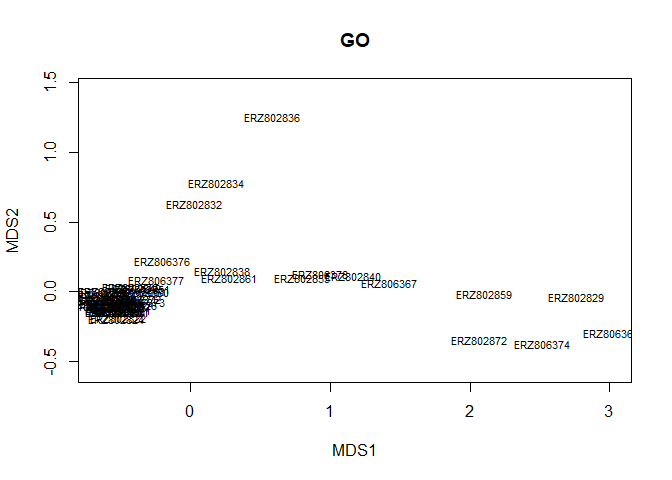

Se observa un cluster, el resto son independientes.

``` r
stressplot(ebi_go_abundances_ss_bray.nmds, main = "GO")
```

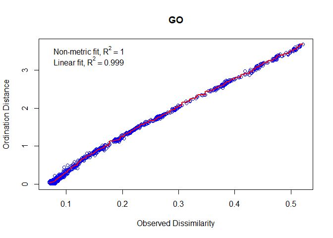

### GO-SLIM

``` r
ebi_go.slim_abundances_ss_bray <- vegdist(ebi_go.slim_abundances_ss, method="bray")
ebi_go.slim_abundances_ss_bray.nmds <- monoMDS(ebi_go.slim_abundances_ss_bray)

plot(ebi_go.slim_abundances_ss_bray.nmds, main = "GO-SLIM")
```

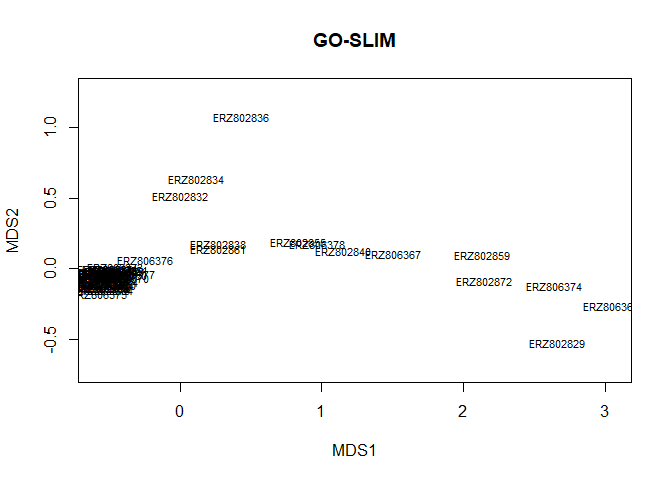

Se observa un cluster, el resto son independientes.

``` r
stressplot(ebi_go.slim_abundances_ss_bray.nmds, main = "GO-SLIM")
```

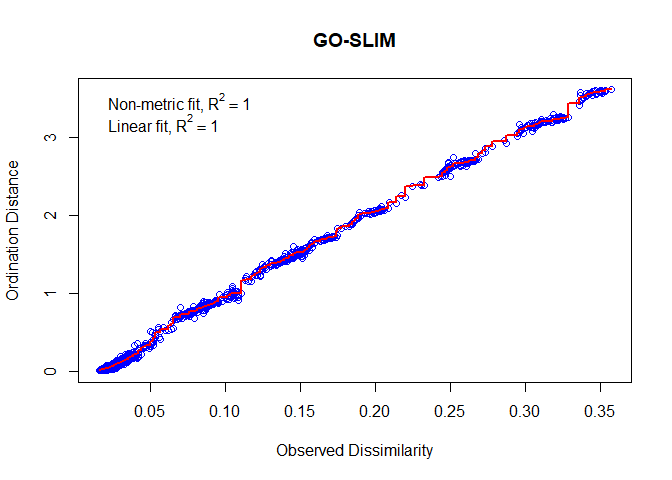

### IPR

``` r
ebi_ipr_abundances_ss_bray <- vegdist(ebi_ipr_abundances_ss, method="bray")
ebi_ipr_abundances_ss_bray.nmds <- monoMDS(ebi_ipr_abundances_ss_bray)

plot(ebi_ipr_abundances_ss_bray.nmds, main = "IPR")
```

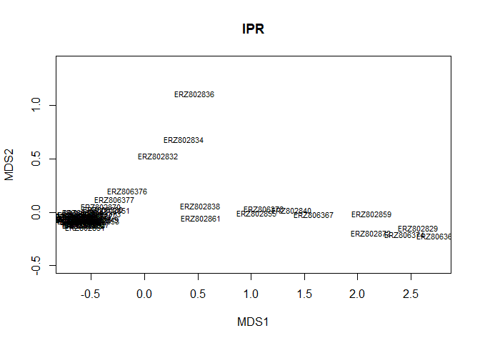

Se ve un cluster.

``` r
stressplot(ebi_ipr_abundances_ss_bray.nmds, main = "IPR")
```

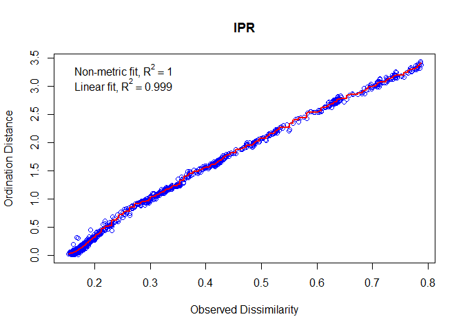

## Dendograms

### GO

``` r
ebi_go_abundances_ss_bray_hclust <- hclust(ebi_go_abundances_ss_bray, method="average")
plot(ebi_go_abundances_ss_bray_hclust, main = "GO")
```

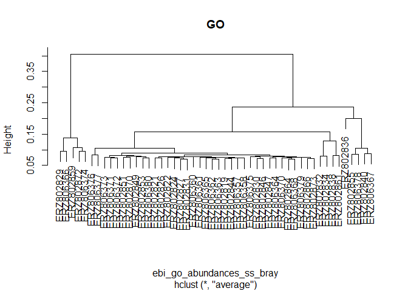

Se observan dos grupos principales, uno de ellos es mucho mas grande y tiene bastantes subdivisiones, siendo las dos primeras.

### GO-SLIM

``` r
ebi_go.slim_abundances_ss_bray_hclust <- hclust(ebi_go.slim_abundances_ss_bray, method="average")
plot(ebi_go.slim_abundances_ss_bray_hclust, main = "GO-SLIM")
```

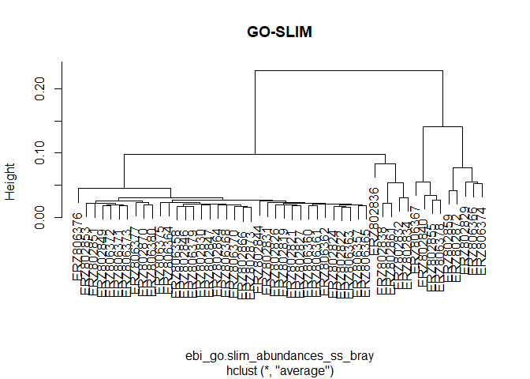

Muy parecido al GO, pero con distinta longitud de ramas.

### IPR

``` r
ebi_ipr_abundances_ss_bray_hclust <- hclust(ebi_ipr_abundances_ss_bray, method="average")
plot(ebi_ipr_abundances_ss_bray_hclust, main = "IPR")
```

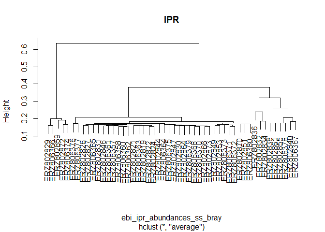

Se observan dos grupos principales, uno de ellos es mucho mas grande y tiene bastantes subdivisiones, distribuidas de distinta forma que en GO.

# ICM tables

## Table reading ICM

``` r
icm_cog_meta <- t(read.table("functional.tables/EMOSE-GC_ICM_250bp_COG.lengthNorm.metaGsizeNorm.counts.tbl", header = TRUE, sep = "\t", row.names = 1))
icm_cog_scg <- t(read.table("functional.tables/EMOSE-GC_ICM_250bp_COG.lengthNorm.SCGnorm.counts.tbl", header = TRUE, sep = "\t", row.names = 1))

icm_kegg_meta <- t(read.table("functional.tables/EMOSE-GC_ICM_250bp_KEGG.ko.lengthNorm.metaGsizeNorm.counts.tbl", header = TRUE, sep = "\t", row.names = 1))
icm_kegg_scg <- t(read.table("functional.tables/EMOSE-GC_ICM_250bp_KEGG.ko.lengthNorm.SCGnorm.counts.tbl", header = TRUE, sep = "\t", row.names = 1))

icm_pfam_meta <- t(read.table("functional.tables/EMOSE-GC_ICM_250bp_pfam.lengthNorm.metaGsizeNorm.counts.tbl", header = TRUE, sep = "\t", row.names = 1))
icm_pfam_scg <- t(read.table("functional.tables/EMOSE-GC_ICM_250bp_pfam.lengthNorm.SCGnorm.counts.tbl", header = TRUE, sep = "\t", row.names = 1))
```

## NMDs

### COG

``` r
icm_cog_meta_bray <- vegdist(icm_cog_meta, method="bray")
icm_cog_scg_bray <- vegdist(icm_cog_scg, method="bray")

icm_cog_meta_bray.nmds <- monoMDS(icm_cog_meta_bray)
icm_cog_scg_bray.nmds <- monoMDS(icm_cog_scg_bray)

# MetaGS
plot(icm_cog_meta_bray.nmds, main = "COG MetaGS")
```

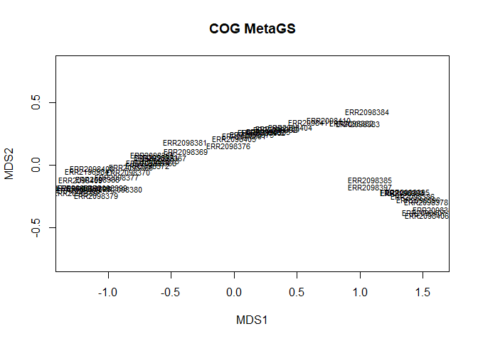

``` r
# SC
plot(icm_cog_scg_bray.nmds, main = "COG SCG")
```

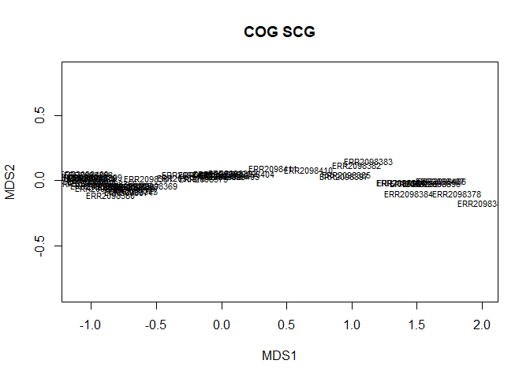

COG MetaGS: Se pueden observar 4 clusters distintos, tres de ellos cercanos y uno mas distante y sin relación.

COG SCG: Se peuden observar 3 clusters, dos de ellos proximos y uno mas separado pero que aun parece mantener una relación.

``` r
stressplot(icm_cog_meta_bray.nmds, main = "COG MetaGS")
```

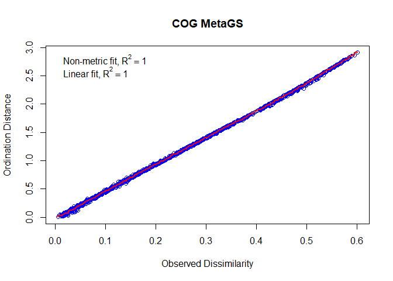

``` r
stressplot(icm_cog_scg_bray.nmds, main = "COG SCG")
```

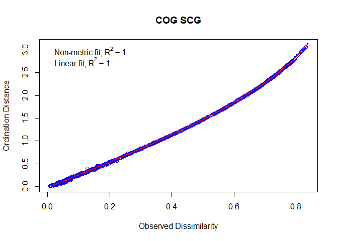

### KEGG

``` r
icm_kegg_meta_bray <-vegdist(icm_kegg_meta, method="bray") 
icm_kegg_scg_bray <-vegdist(icm_kegg_scg, method="bray") 

icm_kegg_meta_bray.nmds <- monoMDS(icm_kegg_meta_bray)
icm_kegg_scg_bray.nmds <- monoMDS(icm_kegg_scg_bray)

# MetaGS
plot(icm_kegg_meta_bray.nmds, main = "KEGG MetaGS")
```

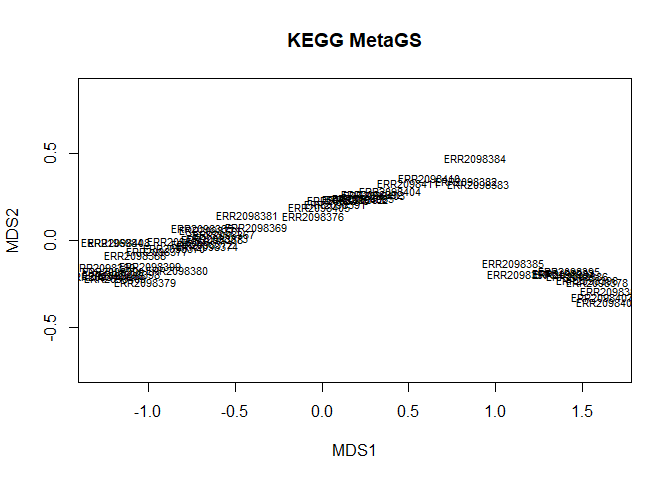

``` r
# SC
plot(icm_kegg_scg_bray.nmds, main = "KEGG SCG")
```

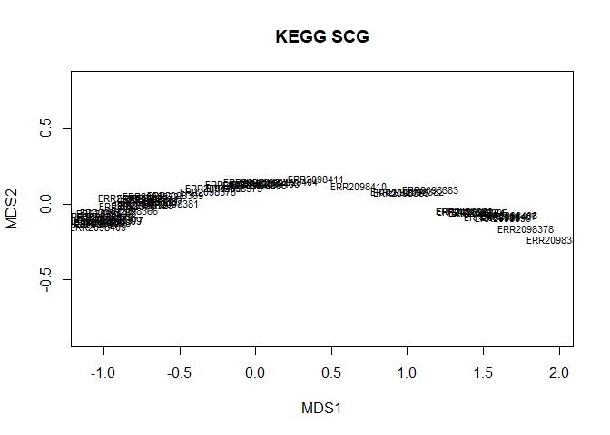

KEGG MetaGS: Se observan 4 clusters, en este caso parecen mejor separados, aunque dos de ellos son bastante proximos.

KEGG SCG: Se observan 4 clusters, dos de ellos muy proximos, cerca otro y el cuarto parece bastante alejado.

``` r
stressplot(icm_kegg_meta_bray.nmds, main = "KEGG MetaGS")
```

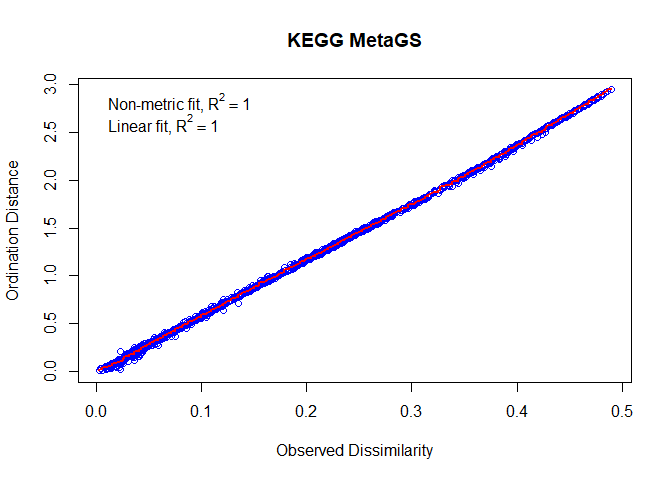

``` r
stressplot(icm_kegg_scg_bray.nmds, main = "KEGG SCG")
```

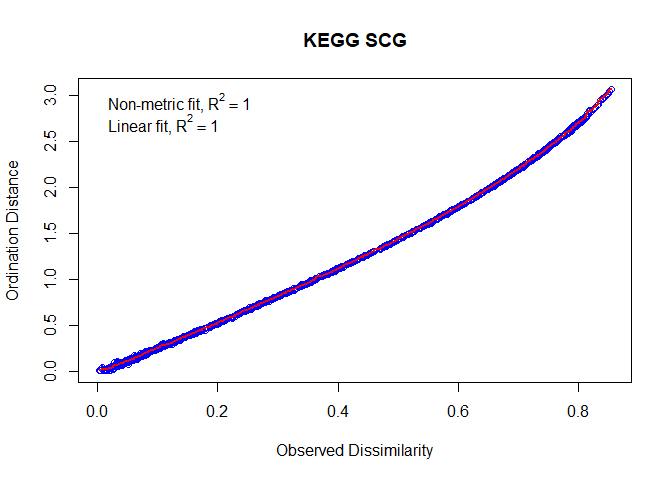

### PFAM

``` r
icm_pfam_meta_bray <-vegdist(icm_pfam_meta, method="bray") 
icm_pfam_scg_bray <-vegdist(icm_pfam_scg, method="bray")

icm_pfam_meta_bray.nmds <- monoMDS(icm_pfam_meta_bray)
icm_pfam_scg_bray.nmds <- monoMDS(icm_pfam_scg_bray)

# MetaGS
plot(icm_pfam_meta_bray.nmds, main = "PFAM MetaGS")
```

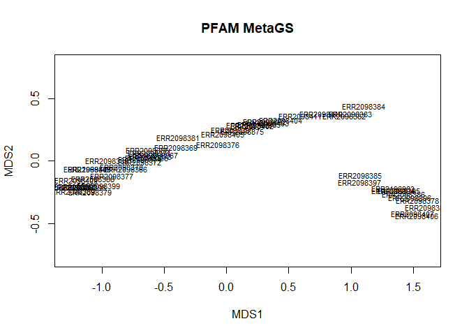

``` r
# SC
plot(icm_pfam_scg_bray.nmds, main = "PFAM SCG")
```

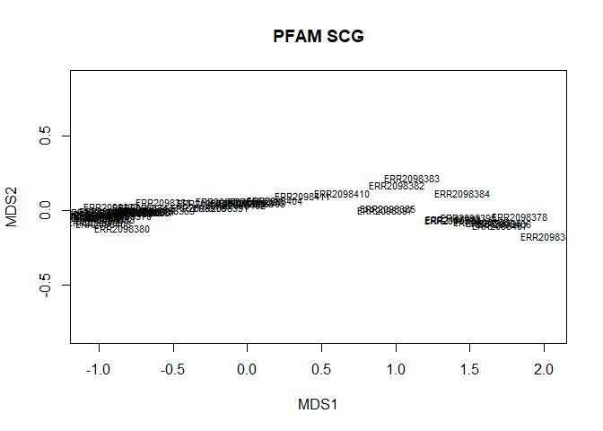

PFAM MetaGS: En este caso los clusters no estan tan bien definidos, pero se pueden llegar a distinguir 4, dos muy cercanos, un tercero que mantiene relacion y el cuarto totalmente aislado.

PFAM SCG: Se observan 4 clusters, dos de ellos casi solapados, el tercero bastante cerca (mas que en los casos anteriores) y el cuarto aislado.

``` r
stressplot(icm_pfam_meta_bray.nmds, main = "PFAM MetaGS")
```


``` r
stressplot(icm_pfam_scg_bray.nmds, main = "PFAM SCG")
```


## Dendograms

### COG

``` r
icm_cog_meta_bray_hclust <- hclust(icm_cog_meta_bray, method="average")
plot(icm_cog_meta_bray_hclust, main = "COG MetaGS")
```

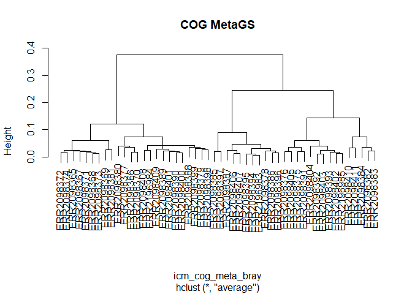

``` r
icm_cog_scg_bray_hclust <- hclust(icm_cog_scg_bray, method="average")
plot(icm_cog_scg_bray_hclust, main = "COG SCG")
```

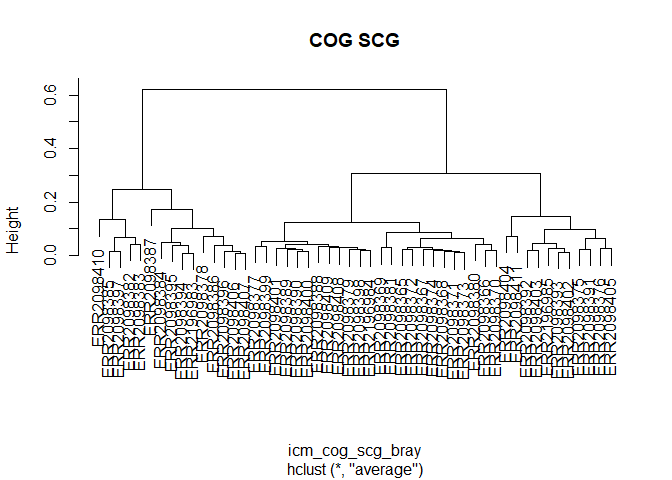

COG MetaGS: Se observan dos grupos principales que, a su vez, tienen dos subgrupos. Concuerda con los 4 clusters.

COG SCG: Se observan dos grupos principales, uno de ellos parece tener una subdivision importante, en el otro parece no ser tan importante. Concuerda con los clusters.

### KEGG

``` r
icm_kegg_meta_bray_hclust <-hclust(icm_kegg_meta_bray, method="average")
plot(icm_kegg_meta_bray_hclust, main = "KEGG MetaGS")
```

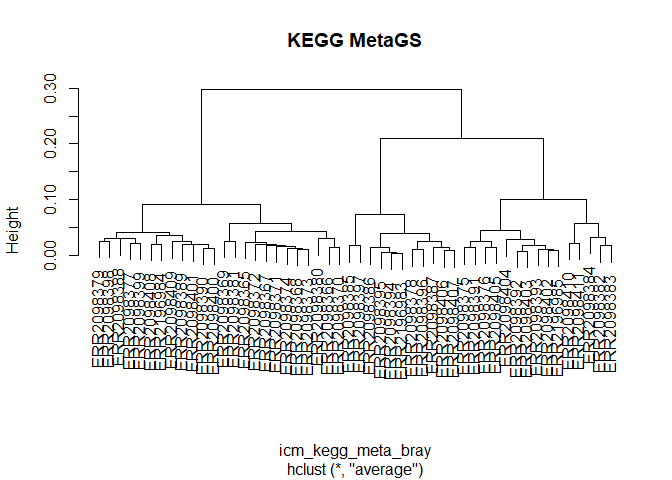

``` r
icm_kegg_scg_bray_hclust <-hclust(icm_kegg_scg_bray, method="average")
plot(icm_kegg_scg_bray_hclust, main = "KEGG SCG")
```

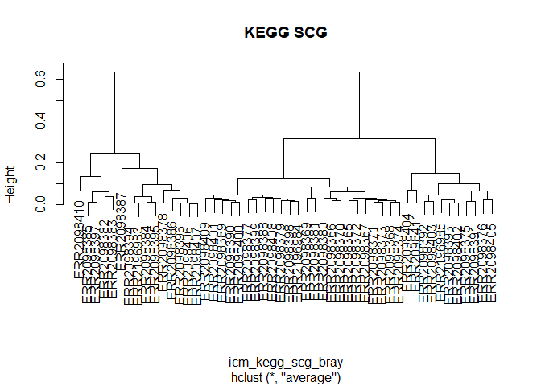

KEGG MetaGS: Se pueden observar dos grupos principales y cada uno de ellos dividido en otros dos grupos principales. Concuerda con los clusters.

KEGG SCG: Se pueden observar 2 grupos principales, divididos en otros dos grupos principales cada uno. Concuerda con los clusters.

Muy parecidos a los obtenidos usando COG.

### PFAM

``` r
icm_pfam_meta_bray_hclust <-hclust(icm_pfam_meta_bray, method="average")
plot(icm_pfam_meta_bray_hclust, main = "PFAM MetaGS")
```

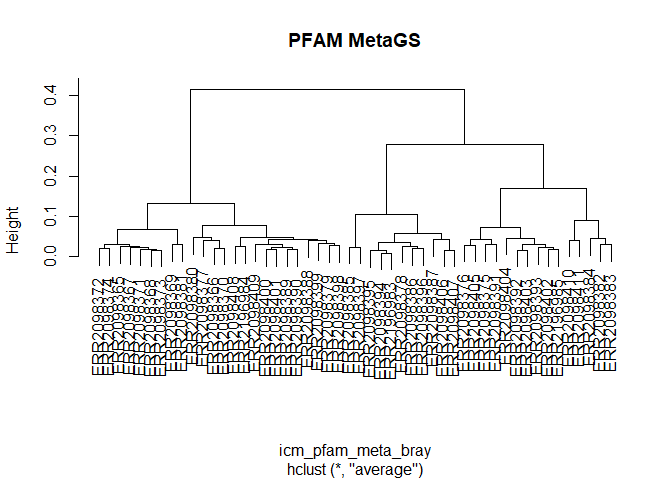

``` r
icm_pfam_scg_bray_hclust <-hclust(icm_pfam_scg_bray, method="average")
plot(icm_pfam_scg_bray_hclust, main = "PFAM SCG")
```

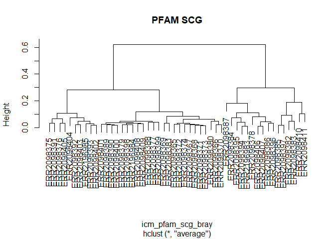

PFAM MetaGS: Se pueden observar 2 grupos principales, divididos en otros dos grupos principales cada uno, pero a partir de ahi las divisiones son muy cortas, familias proximas.

PFAM SCG: En este caso, despues de la division principal, en uno de los grupos se puede observar que las relaciones son muy cercanas.

En ambos casos concuerda con los clusters poco definidos, que implican familias próximas.

## Conclusion EBI vs ICM

En ambos casos los NMDs coinciden con los dendogramas, son coherentes. Por otra parte, los datos obtenidos por el ICM tienen mucha mas capacidad para clasificar en diferentes familias o genes y manteniendo la coherencia entre NMDS y dendogramas.

Por tanto, considero que el tratamiento/pipeline utilizada en el ICM, con la finalidad de clasificación, es bastante más útil que la usada en el IBM, Mgnify.

# OTU tables MiTags

``` r
otu_mitags <- (read.delim("functional.tables/otu_table97.txt", header = TRUE, sep = "\t"))
otu_mitags$OTUId <- NULL
otu_mitags <- t(otu_mitags)
```

## Richness

``` r
otu_mitags_ss <- rrarefy(otu_mitags, min(rowSums(otu_mitags)))
richness <- estimateR(otu_mitags_ss)
richness
```

    ##          ERR2098365 ERR2098366 ERR2098367 ERR2098368 ERR2098369 ERR2098370
    ## S.obs    3365.00000 3361.00000 3307.00000 3203.00000 3213.00000 3002.00000
    ## S.chao1  5272.70067 5658.32075 5132.04844 5266.61089 4755.75524 4791.04310
    ## se.chao1  132.75515  160.52707  129.43520  148.43058  113.42592  136.42641
    ## S.ACE    5476.55182 5580.52110 5258.17033 5296.87642 4860.25386 4687.49343
    ## se.ACE     43.07274   42.78591   40.88866   41.68882   38.43078   37.95274
    ##          ERR2098371 ERR2098372 ERR2098373 ERR2098374 ERR2098375 ERR2098376
    ## S.obs     3060.0000 3078.00000 3039.00000 3027.00000 3179.00000  2900.0000
    ## S.chao1   4528.8333 4788.56773 4613.45401 4566.89423 4585.77665  4535.0679
    ## se.chao1   110.9563  128.30511  119.31444  116.57343  104.35978   121.6378
    ## S.ACE     4601.3121 4781.02757 4636.58113 4643.33603 4677.05389  4675.2172
    ## se.ACE      36.8774   38.32991   37.69427   37.67291   36.70486    38.9626
    ##          ERR2098377 ERR2098378 ERR2098379 ERR2098380 ERR2098381 ERR2098382
    ## S.obs     3085.0000  819.00000 2834.00000  2736.0000 3341.00000 3093.00000
    ## S.chao1   4854.3533 1954.26000 4378.18363  3900.6674 5121.65664 4368.01056
    ## se.chao1   131.9617  157.24130  122.00072    96.5153  127.77676   97.65941
    ## S.ACE     4831.4523 2055.82763 4357.29589  3874.8882 5091.62206 4445.96222
    ## se.ACE      38.6111   30.27427   35.97652    32.2697   39.27557   35.74825
    ##          ERR2098383 ERR2098384 ERR2098385 ERR2098386 ERR2098387 ERR2098388
    ## S.obs    3082.00000 2699.00000 1906.00000 1181.00000  550.00000 2886.00000
    ## S.chao1  4839.57143 3755.77160 3887.87616 2623.31429 1175.44776 4696.54128
    ## se.chao1  128.81029   88.08889  167.32074  158.05520  108.58689  140.53988
    ## S.ACE    4880.66091 3804.80470 4239.65014 2892.37750 1203.10313 4601.58949
    ## se.ACE     40.22799   32.54320   42.44651   36.36793   22.94978   38.47109
    ##          ERR2098389 ERR2098390 ERR2098391 ERR2098392 ERR2098393 ERR2098394
    ## S.obs    2870.00000  2776.0000 3578.00000 3339.00000 3681.00000 1278.00000
    ## S.chao1  4672.27397  4258.4286 5748.54124 4578.00162 5628.88788 2777.88060
    ## se.chao1  139.80650   118.3527  148.69841   93.18277  130.98084  155.66795
    ## S.ACE    4617.31468  4260.2625 5674.15412 4633.39681 5772.10243 3118.73444
    ## se.ACE     38.37816    35.8905   42.50159   35.20808   42.64608   37.54056
    ##          ERR2098395 ERR2098396 ERR2098397 ERR2098398 ERR2098399 ERR2098400
    ## S.obs    1175.00000 1037.00000 1878.00000 2672.00000 2759.00000 2817.00000
    ## S.chao1  2549.58659 2149.42857 3610.31325 4118.77536 4108.04283 4512.76429
    ## se.chao1  150.50933  130.49349  148.12624  118.92742  108.28596  134.78796
    ## S.ACE    2801.64002 2386.79637 3910.88538 4067.34332 4179.70582 4375.79810
    ## se.ACE     35.96848   31.76282   41.60748   34.84222   35.28311   36.22679
    ##          ERR2098401 ERR2098402 ERR2098403 ERR2098404 ERR2098405 ERR2098406
    ## S.obs    2707.00000 3602.00000 3548.00000 3719.00000 3669.00000  949.00000
    ## S.chao1  4085.12472 5362.32526 5266.98596 5572.54559 5846.52564 2086.93651
    ## se.chao1  112.11041  120.70233  119.52558  124.12653  145.85223  144.96480
    ## S.ACE    4101.18341 5440.52851 5383.71971 5702.38300 5860.53307 2131.38718
    ## se.ACE     35.30165   40.52403   40.08678   41.62952   42.81648   30.07715
    ##          ERR2098407 ERR2098408 ERR2098409 ERR2098410 ERR2098411 ERR2196983
    ## S.obs     956.00000 2465.00000 2517.00000  3435.0000  3487.0000 1380.00000
    ## S.chao1  2031.59310 3666.36480 4158.04155  5389.6805  5233.4868 3236.18932
    ## se.chao1  131.50038  104.04546  137.77174   136.7620   123.2516  185.11887
    ## S.ACE    2359.17830 3695.76462 4048.66953  5352.2384  5221.7390 3713.01104
    ## se.ACE     33.03824   33.04787   35.34533    40.3269    38.9556   41.13399
    ##          ERR2196984 ERR2196985
    ## S.obs    2802.00000 3752.00000
    ## S.chao1  4446.18794 5960.49304
    ## se.chao1  130.34116  145.87539
    ## S.ACE    4378.33413 6015.59257
    ## se.ACE     36.76492   43.87555

## Rarefaction

``` r
#otu_rare <- rarefaction(otu_mitags_ss)
```

No he sido capaz de correr este plot.

## Rarecurve

``` r
#otu_rcurve <- rarecurve(otu_mitags_ss)
```

## Acumulation curve

``` r
#otu_acc <- specaccum(otu_mitags_ss, method = "exact", permutations = 1000)
#plot(otu_acc)
```

## Eveness

``` r
plot(radfit(colSums(otu_mitags_ss)))
```

    ## Error in glm.fit(x = structure(c(1, 1, 1, 1, 1, 1, 1, 1, 1, 1, 1, 1, 1,  : 
    ##   NA/NaN/Inf in 'x'

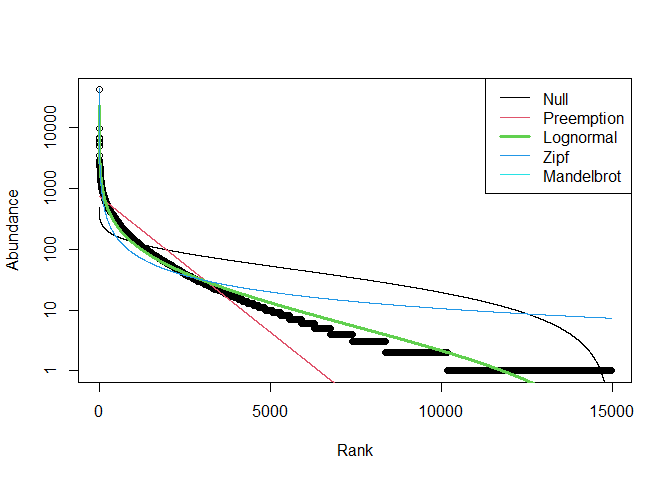

## Preston fit

``` r
otu_preston<-prestonfit(colSums(otu_mitags_ss))
otu_prestondistr<-prestondistr(colSums(otu_mitags_ss))
plot(otu_preston)
lines(otu_prestondistr, line.col="blue3")
```

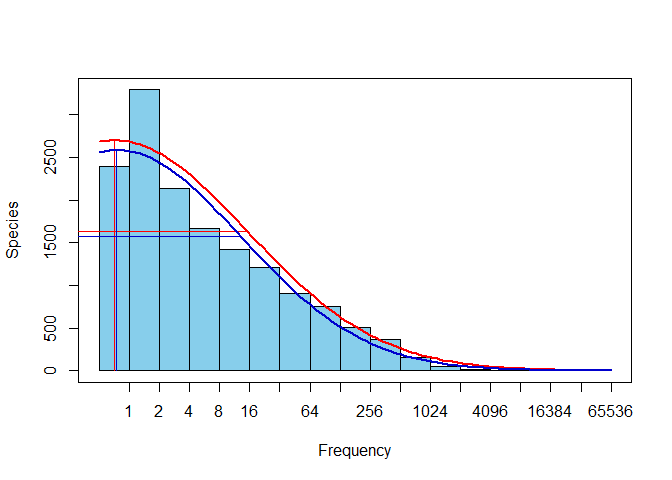

## NMDS

``` r
otu_mitags_ss_bray <- vegdist(otu_mitags_ss, method="bray")
otu_mitags_ss_bray.nmds <- monoMDS(otu_mitags_ss_bray)

otu_mitags_ss_bray.nmds
```

    ## 
    ## Call:
    ## monoMDS(dist = otu_mitags_ss_bray) 
    ## 
    ## Non-metric Multidimensional Scaling
    ## 
    ## 50 points, dissimilarity 'bray', call 'vegdist(x = otu_mitags_ss, method = "bray")'
    ## 
    ## Dimensions: 2 
    ## Stress:     0.1002382 
    ## Stress type 1, weak ties
    ## Scores scaled to unit root mean square, rotated to principal components
    ## Stopped after 93 iterations: Stress nearly unchanged (ratio > sratmax)

``` r
plot(otu_mitags_ss_bray.nmds, main = "MiTags")
```

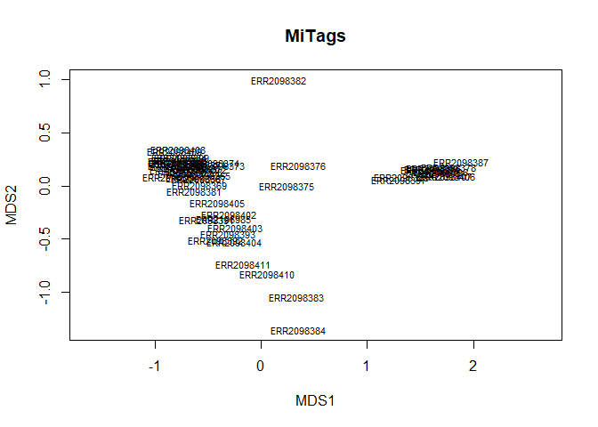

``` r
stressplot(otu_mitags_ss_bray.nmds, main = "MiTags")
```

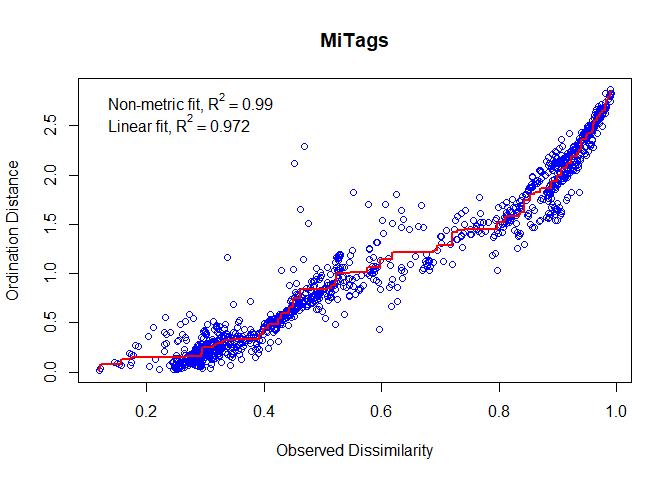

## UPGMA

``` r
otu_mitags_ss_hclust <- hclust(otu_mitags_ss_bray, "average")
plot(otu_mitags_ss_hclust)
```

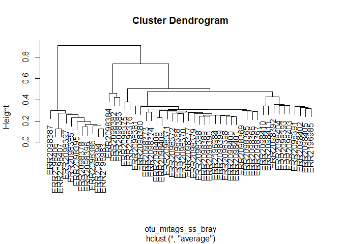

``` r
otu_mitags_ss_hclust
```

    ## 
    ## Call:
    ## hclust(d = otu_mitags_ss_bray, method = "average")
    ## 
    ## Cluster method   : average 
    ## Distance         : bray 
    ## Number of objects: 50

## DCA

``` r
otu_dca <- decorana(otu_mitags_ss)
```

    ## Warning in decorana(otu_mitags_ss): some species were removed because they were
    ## missing in the data

``` r
plot(otu_dca, display = "sites")
```

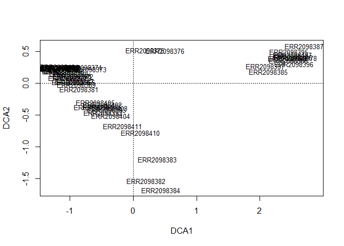

``` r
plot(otu_dca, display = "species")
```

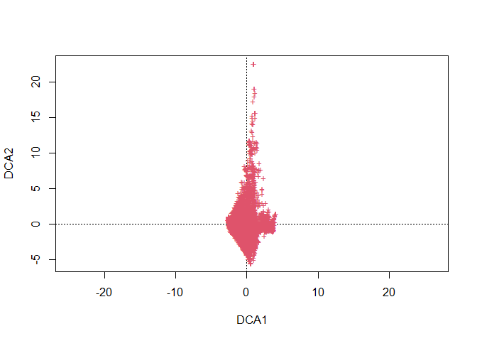

## Mantel test

``` r
otu_mitags_bray <- vegdist(otu_mitags, method="bray")
plot(otu_mitags_ss_bray,otu_mitags_bray)
abline(0,1, col = "red")
```

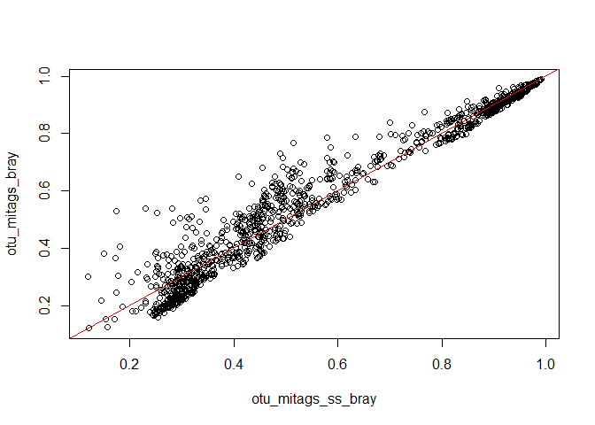

``` r
mantel(otu_mitags_ss_bray,otu_mitags_bray)
```

    ## 
    ## Mantel statistic based on Pearson's product-moment correlation 
    ## 
    ## Call:
    ## mantel(xdis = otu_mitags_ss_bray, ydis = otu_mitags_bray) 
    ## 
    ## Mantel statistic r: 0.9761 
    ##       Significance: 0.001 
    ## 
    ## Upper quantiles of permutations (null model):
    ##    90%    95%  97.5%    99% 
    ## 0.0719 0.1028 0.1241 0.1527 
    ## Permutation: free
    ## Number of permutations: 999

Una buena correlación implica que el subsampling es correcto y que no afecta negativamente al analysis.

## Conclusión ITags vs MiTags

Comparando los plots obtenidos por MiTags e ITags (16S), puedo ver diferencias, pero no sabria interpretarlas.

Ahora bien, leyendo y utilizando el paper "Metagenomic 16S rDNA Illumina tags are a powerfulalternative to amplicon sequencing to explore diversityand structure of microbial communities", se puede deducir que usando MiTags la detección de OTUs es mas óptima.
